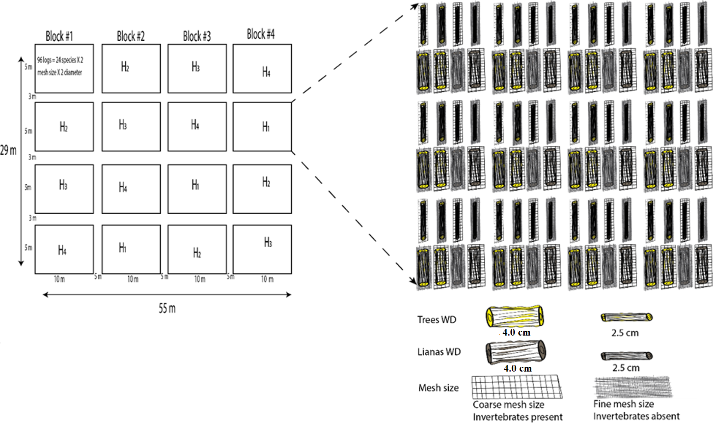
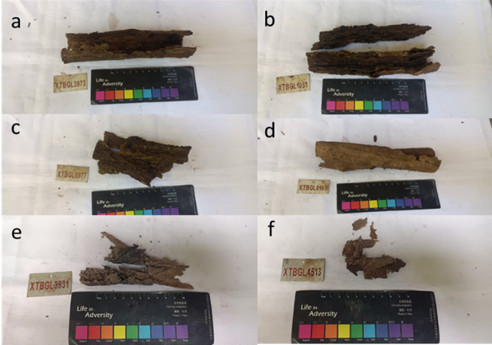

```{r setup, include=FALSE, message=FALSE, results='hide'}
knitr::opts_chunk$set(echo = TRUE)
```


# Introduction

Wood decomposition is important to redistribute nutrient within ecosystems. But most of our knowledge of this process is based on empirical research on one plant growth form. In tropical and subtropical forests, the contribution of lianas another important plant growth form may also be important to forest carbon and nutrient dynamics. Lianas usually have high stem turnover rates and may produce softer wood with a distinct chemical profile that may decay more rapidly than trees. Although, numerous studies have examined chemical profile of tree and liana leaves, to date, however, the chemical profile and afterlife and decomposition dynamics of lianas remained unknown. In this experiment, we attempt to fill this gap by directly contrasting wood decomposition of 12 liana and 12 tree species in a tropical forest in China. We hypothesized that: 1) liana wood decomposes faster than tree wood; 2) liana wood characteristics differ systematically from tree wood; and 3) microbial decay is higher for liana wood due to its larger vessels and richer nutrients content, and thus have a stronger effect on the wood decay of lianas compared to trees.
We used a common garden as depicted in the following figure S2 .

Figure S2


## Load needed libraries

```{r,message=FALSE,warning=FALSE}
library(dplyr)
library(tidyverse)
library(ggplot2)
library(patchwork)
library(lme4)
library(lmerTest)
library(MuMIn)

```


# Initial logs trait data before field incubation

Here we load the initial traits (from the file called "Experiment2_data_sheet.csv") measured for each woody debris (WD) of the 12 species of liana and 12 species of trees. This includes, diameter, bark thickness, initial mass of each WD, the length of each WD used and the unique tag given to each WD before field incubation and the type of litterbag mesh size in which each WD was placed in. Moreover, for each WD, one initial disk was collected, the volumes (dry and wet) of the disk mass of fresh and dry disk (completed at 105 degrees) were measured. We later used this to measure the initial water content and compute the dry mass of each WD prior to incubation. 


```{r, message=FALSE, warning=FALSE, echo=FALSE, results='hide'}
in_dat<-read.csv("Experiment2_datasheet.csv", header = TRUE, sep = ",", quote = "\"",
              dec = ".", fill = TRUE, comment.char = "",fileEncoding = 'latin1')

str(in_dat)
```

## Data exploration 

Let's convert some variables to numeric and some to factors.

```{r,message=FALSE,warning=FALSE, results='hide'}
#convert to numeric

in_dat$diameter_1.size_cm<- as.numeric(in_dat$diameter_1.size_cm)
in_dat$diameter_2.size_cm<- as.numeric(in_dat$diameter_2.size_cm)
in_dat$diameter_3.size_cm<- as.numeric(in_dat$diameter_3.size_cm)
in_dat$Bark.thickness_1._mm<- as.numeric(in_dat$Bark.thickness_1._mm)
in_dat$Bark.thickness_2._mm<- as.numeric(in_dat$Bark.thickness_2._mm)
in_dat$Bark.thickness_3._mm<- as.numeric(in_dat$Bark.thickness_3._mm)
in_dat$Bark.thickness_4_mm<- as.numeric(in_dat$Bark.thickness_4_mm)

in_dat$Wet_weight_of_wood_block_g <- as.numeric(in_dat$Wet_weight_of_wood_block_g)
in_dat$Wet_weight_of_small_pieces_of_wood_g<- as.numeric(in_dat$Wet_weight_of_small_pieces_of_wood_g)
in_dat$Dry_weight_of_small_wood_blocks_g <-as.numeric(in_dat$Dry_weight_of_small_wood_blocks_g)

#convert to factors
in_dat $species<-as.factor(in_dat$species)
in_dat $growth_form<-as.factor(in_dat$growth_form)
in_dat$Tag<-as.factor(in_dat$Tag)
in_dat$species_label<-as.factor(in_dat$species_label)
in_dat$mesh_size<-as.factor(in_dat$mesh_size)
in_dat$family<-as.factor(in_dat$family)
in_dat$diameter_class<- as.factor(in_dat$diameter_class)
summary(in_dat)
dim(in_dat)
```


### Calculate average bark thickness

At the set up, we measured bark thickness at both ends of each log (two readings per end). Here we are going to calculate the average of bark thickness per log.

```{r,message=FALSE,warning=FALSE}
in_dat$av_bark_thickness<- (in_dat$Bark.thickness_1._mm+in_dat$Bark.thickness_2._mm+in_dat$Bark.thickness_3._mm+in_dat$Bark.thickness_4_mm)/4
```

### Does the average WD density vary with the growth forms?

One argument that might support to why lianas are likely to decompose at a faster rate than trees is the difference in wood densities. From literature, we see that trees have denser woods while lianas woody debris (WD) have wider vessels hence lower density. Here, we test whether this assumption of trees having higher density holds for our wood samples by calculating their wood density and ask: does the average WD wood density vary with the growth forms? We calculate the WD wood density as (mass/volume) for the dry WD subsections. 

```{r,message=FALSE,warning=FALSE, results="hide"}
in_dat$density<- in_dat$Dry_weight_of_small_wood_blocks_g/in_dat$Dry_volume_of_small_wood_blocks.g
summary(in_dat)
in_dat$density<-as.numeric(in_dat$density)
#plot(density~ growth_form, data=in_dat)
```

```{r,message=FALSE,warning=FALSE}
anvb<- aov(density~growth_form*diameter_class,data=in_dat)
anova(anvb)
summary(anvb)
```

Here we plot this plot using ggplot for better visualization

```{r,message=FALSE,warning=FALSE}
sdiam<- in_dat[in_dat$diameter_class %in% c("2.5 cm"), ]
anvsm<- aov(density~growth_form,data=sdiam)
anova(anvsm)
summary(anvsm)
lblsdiam <- expression(paste( F["(1, 780)"],"   =   210.6"))
dens_plotsmall<- ggplot(sdiam, aes(x = growth_form, y = density)) +
  geom_jitter(aes(color = growth_form,shape=growth_form), size = 3, alpha = 0.8, width = 0.1)+ scale_y_continuous(limits = c(0,1))+
  scale_shape_manual(values=c(15,17))+
  geom_boxplot(outlier.shape = NA, alpha = 0) +
  labs(y = bquote(bold("Woody debris density " (g/cm^3))), x = "Growth form",colour= "Growth form",title = "2.5 cm diameter WD") +
  theme_classic() +
  annotate("text", x = 1.5, y = 1, size=3, label = as.character(lblsdiam),parse=TRUE) +
  annotate("text", x = 1.5, y = 0.95, size=3, label = "P < 0.001") +
  theme(legend.position = "none" )+
  theme(plot.title=element_text(
    size=12, color="black", vjust = 1, hjust = 0.5),
    axis.text = element_text(size=11, color="black", face = "bold"),
    axis.title = element_text(size=12, color = "black",face = "bold"))+
  scale_color_brewer(palette = "Set1")+
  theme(text = element_text(size = 11,face="bold"), 
        panel.background = element_blank(),
        panel.grid.major = element_blank(), 
        panel.grid.minor = element_blank(),
        axis.line = element_line(colour = "black"),
        panel.border = element_rect(colour = "black", fill=NA, size=1.5))+
  theme(strip.text.x = element_text(size = 10.5))
dens_plotsmall

```


```{r,message=FALSE,warning=FALSE} 
bdiam<- in_dat[in_dat$diameter_class %in% c("5.0 cm"), ]
anvb<- aov(density~growth_form,data=bdiam)
anova(anvb)
summary(anvb)
lblbdiam<-expression(paste( F["(1, 740)"],"   =   209.9"))
dens_plotbig<- ggplot(bdiam, aes(x = growth_form, y = density)) +
  geom_jitter(aes(color = growth_form,shape=growth_form), size = 3, alpha = 0.8, width = 0.1)+ scale_y_continuous(limits = c(0,1))+
  scale_shape_manual(values=c(15,17))+
  geom_boxplot(outlier.shape = NA, alpha = 0) +
  labs(y = bquote(bold("Woody debris density " (g/cm^3))), x = "Growth form",colour= "Growth form",title = "4.0 cm diameter WD") +
  theme_classic() +
  annotate("text", x = 1.5, y = 1, size=3, hjust=0.5,label = as.character(lblbdiam),parse=TRUE)+
  annotate("text", x = 1.5, y = 0.95, size=3, label = "P < 0.001") +
  theme(legend.position = "none" )+
  theme(plot.title=element_text(
    size=12, color="black", vjust = 1, hjust = 0.5),
    axis.text = element_text(size=11, color="black"),
    axis.title = element_text(size=12, color = "black"))+
  scale_color_brewer(palette = "Set1")+
  theme(text = element_text(size = 10,face="bold"), 
        panel.background = element_blank(),
        panel.grid.major = element_blank(), 
        panel.grid.minor = element_blank(),
        axis.line = element_line(colour = "black"),
        panel.border = element_rect(colour = "black", fill=NA, size=1.5))+
  theme(strip.text.x = element_text(size = 10.5))
dens_plotbig
```


```{r,message=FALSE,warning=FALSE}
dens_plot<- dens_plotsmall+dens_plotbig
path<- getwd()
#ggsave(filename="dens_plot.png", plot=dens_plot, device="png",
#       path=path, height=4, width=8, units="in", dpi=500)
```

```{r,message=FALSE,warning=FALSE}
density_mean<- in_dat%>% group_by( growth_form ,species)%>% summarise(mean_density= mean(density, na.rm=TRUE))
density_mean

# Function to classify density within each growth form to low, medium or high
classify_density_by_A <- function(df) {
  low_threshold <- quantile(df$mean_density, 0.33,na.rm=TRUE)
  high_threshold <- quantile(df$mean_density, 0.66,na.rm=TRUE)
  
  df$density_class <- ifelse(df$mean_density <= low_threshold, paste(unique(df$growth_form), "low"),
                             ifelse(df$mean_density <= high_threshold, paste(unique(df$growth_form), "medium"),
                                    paste(unique(df$growth_form), "high")))
  return(df)
}
# Apply the function to each group of A
library(dplyr)
data_density <- density_mean %>%
  group_by(growth_form) %>%
  group_modify(~ classify_density_by_A(.x)) %>%
  ungroup() #important to ungroup after group_modify
data_density 
```


### Does the bark thickness vary with growth forms across the different wood diameter?  

The other argument we gave as to why Lianas are likely to decompose at a faster rate than trees is the differences in bark proportions, from literature, we see that trees WD bark proportion is lower while lianas  WD have higher bark proportion here we test whether this assumption holds for our wood samples by calculating their density does the average WD bark proportion vary with the growth forms does the bark thickness vary with growth forms across the different wood diameter 

#calculate average diameter 
```{r,message=FALSE,warning=FALSE}
in_dat$av_wd_diameter<- (in_dat$diameter_2.size_cm+in_dat$diameter_2.size_cm+in_dat$diameter_3.size_cm)/3
in_dat$wd_under_bark<- in_dat$av_wd_diameter-(in_dat$av_bark_thickness/10)
```

```{r,message=FALSE,warning=FALSE}
in_dat%>% group_by(diameter_class)%>% summarise(mean=mean(av_wd_diameter, na.rm = TRUE),
                                            sd= sd(av_wd_diameter, na.rm=TRUE),
                                      se=sd(av_wd_diameter,na.rm = TRUE)/sqrt(n())    
                                    )


in_dat%>% group_by(diameter_class)%>% summarise(median=median(av_wd_diameter, na.rm = TRUE) ) 
```

Measuring bark percentage (check the link below) also see Berendt et al 2021 European Journal of Wood and Wood Products 
https://fennerschool-associated.anu.edu.au/mensuration/BrackandWood1998/BARK.HTM#.
The proportion of fresh bark volume (Vbark) was calculated as the difference between the disc’s fresh volume over bark (Vo.b.) and under bark (Vu.b.) divided by Vo.b.:

The bark to inner wood diameter ratio (bark:wood ratio) was calculated by taking 2x the average bark thickness divided by the diameter of the inner wood.

```{r,message=FALSE,warning=FALSE}
in_dat$bark_wd_ratio<- 2*in_dat$av_bark_thickness/in_dat$wd_under_bark

#plot(bark_wd_ratio~ growth_form, data=in_dat)
av1<- aov(bark_wd_ratio~growth_form*diameter_class,data=in_dat)
anova(av1)
summary(av1)

av2<- aov(bark_wd_ratio~growth_form+diameter_class,data=in_dat)
anova(av2)
summary(av2)

av3<- aov(bark_wd_ratio~growth_form,data=in_dat)
anova(av3)
summary(av3)


```

Bark to inner wood ratio is higher for liana species than trees WD.

```{r,message=FALSE,warning=FALSE}

lblbark_wood_ratio<-expression(paste( F["(1, 1469)"],"   =   301.27"))
bark_wd_ratio_plot<- ggplot(in_dat, aes(x = growth_form, y = bark_wd_ratio)) +
  geom_jitter(aes(color = growth_form,shape=growth_form), size = 3, alpha = 0.8, width = 0.1)+
  scale_shape_manual(values=c(15,17))+
  geom_boxplot(outlier.shape = NA, alpha = 0) +
  labs(y = "Bark to inner wood ratio", x = "Growth forms",colour= "Growth forms") +
  annotate("text", x = 1.5, y = 4.2, size=3, hjust=0.5,label = as.character(lblbark_wood_ratio),parse=TRUE)+
  annotate("text", x = 1.5, y = 4, size=3, label = "P < 0.001") +
  theme(legend.position = "none" )+
  theme(plot.title=element_text(
    size=12, color="black", vjust = 1, hjust = 0.5),
    axis.text = element_text(size=11, color="black"),
    axis.title = element_text(size=12, color = "black"))+
  scale_color_brewer(palette = "Set1")+
  theme(text = element_text(size = 10,face="bold"), 
        panel.background = element_blank(),
        panel.grid.major = element_blank(), 
        panel.grid.minor = element_blank(),
        axis.line = element_line(colour = "black"),
        panel.border = element_rect(colour = "black", fill=NA, size=1.5))
#bark_wd_ratio_plot
```

```{r}
#ggsave(filename="bark_wd_ratio.png", plot=bark_wd_ratio_plot, device="png",
#      path=path, height=4, width=5, units="in", dpi=500)
```

### Calculate average density and bark wd ratio for each species 

After calculating the density, we now left join the two columns to our dataset.

```{r,message=FALSE,warning=FALSE}
spc_dens_wdbark<- in_dat %>% group_by(species,diameter_class)%>% 
  summarize(avg_density = mean(density,na.rm = TRUE),
            avg_brkwd_ratio = mean (bark_wd_ratio,na.rm = TRUE), )

in_datb<- in_dat%>% left_join(spc_dens_wdbark, by= c("species","diameter_class"))
```


### Initial dry mass, final dry mass and % mass loss calculations 

To avoid altering or changing the wood structure and properties before field incubation, we did not oven dry the logs. Instead to get the approximate dry mass prior to incubation for each log, we got 5cm discs from the logs and weighed their fresh weight, then the discs were oven dried to a constant mass and this was used to estimate the dry mass of the entire log (initial dry mass).  The initial dry mass of the logs before field incubation  were calculated as in (Seibold et al., 2021) using the following equation:
Dry mass=  [fresh mass]_(20 cm log)/[fresh mass]_(5cm disc) x [dry mass]_(5cm disc)

Percentage mass loss was calculated using the following equation: 

 **ML=(M_initial-M_final)/M_initial x 100 ** 
 Where M_initial represents the initial dry mass of the WD and M_final represents the final dry for the WD at the retrieval time.
 
```{r,message=FALSE,warning=FALSE, results='hide'}
in_dat$initial_mass<- (in_dat$Wet_weight_of_wood_block_g /in_dat$Wet_weight_of_small_pieces_of_wood_g)*in_dat$Dry_weight_of_small_wood_blocks_g
summary(in_dat)
```

# Import the chemistry data for the logs before the start of the experiment 

## Initial chemical traits data 

Each chemical trait [carbon (C), nitrogen (N), phosphorus (P), magnesium (Mg), manganese (Mn), calcium (Ca), potassium (K), silicon (Si), acid-detergent fiber (ADF), acid-detergent lignin (ADL), neutral fiber detergent (NDF), total sugars, condensed tannins)] were measured for each species for the two diameters used in this experiment (~2.0 cm and ~ 4.0 cm diameter). Wood and bark samples were grounded separately to measure the chemical traits. For some species there was no bark that could be used to measure the initial traits and are therefore missing. The initial chemistry is recorded in the file named "Exp1_initial_chemistry.csv". Latter on, we explain how ADL, NDF, and ADF were used to get lignin, cellulose, and hemicellulose.


```{r,message=FALSE,warning=FALSE}
in_trait<-read.csv("Exp2_initial_Chemistry.csv", header = TRUE, sep = ",", quote = "\"",
                   dec = ".", fill = TRUE, comment.char = "",fileEncoding = 'latin1')
summary(in_trait)
in_trait$species<- as.factor(in_trait$species)
#in_trait$ species_name<- as.factor((in_trait$ species_name))
in_trait$diameter_class<- as.factor(in_trait$diameter_class)
in_trait$wood_bark<-as.factor(in_trait$wood_bark)
in_trait$growth_form<-as.factor(in_trait$growth_form)
```

Here we calculate cellulose and hemicellulose content.To do so, here we use the equations provided by Chen et al., 2012 plos one. 
*Hemicellulose = Neutral-detergent fiber–Acid-detergent fiber*;
*Cellulose = Acid-detergent fiber -Lignin*;
Total nonstructural carbohydrate = 1002Neutral-detergent
fiber-Crude protein-Lipid-Ash.

```{r,message=FALSE,warning=FALSE}
in_trait$cellulose <- in_trait$ADF_per- in_trait$ADL_per
in_trait$hemicellulose <- in_trait$NDF_per-in_trait$ADF_per
```

# Wood traits 

We measured wood traits across woody and growth forms. 

## Carbon

```{r,message=FALSE,warning=FALSE}
in_traitw<- in_trait[in_trait$wood_bark %in% c("wood"), ]
hist(in_traitw$T_C)#not bad
av2<- lmer(T_C~ diameter_class*growth_form +(1|species),data = in_traitw)
anova(av2)
r.squaredGLMM(av2)
av3<-update(av2, .~.-diameter_class:growth_form)
summary(av3)
anova(av3)

m<- aov(T_C~growth_form,data=in_traitw)
summary(m)

lblwC<-expression(paste( F["(1,93)"],"   =   4.3"))
w_carb<- ggplot(data = in_traitw, aes(x =growth_form, y =T_C/10)) +
  geom_boxplot(aes(fill = growth_form), color = "black")+ scale_fill_manual(values = c("lightcoral", "#00E5EE"))+
  labs(x= "Growth form", y= "Total carbon (%)", fill= "Growth form", title = "a")+
  annotate("text", x = 1.3, y = 50.5, size=5.5, hjust=0.5,label = as.character(lblwC), parse=TRUE) +
  annotate("text", x = 1.3, y = 49.5, size=5.5, label = "p = 0.04") +
  theme_bw()+
  theme(text = element_text(size = 14,face="bold"), 
        axis.line = element_line(colour = "black"),
        panel.border = element_rect(colour = "black", fill=NA, size=1.5),
        axis.text = element_text(size=12, face= "bold"))+ theme(legend.position = "none")

w_carb

```

This shows higher total carbon in tree wood compared to liana wood.

## Nitrogen
```{r,message=FALSE,warning=FALSE}
hist(in_traitw$T_N)
hist(log(in_traitw$T_N))#not bad
av2<- lmer(log(T_N)~ diameter_class*growth_form +(1|species),data = in_traitw)
anova(av2)
r.squaredGLMM(av2)
av3<-update(av2, .~.-diameter_class:growth_form)
summary(av3)
anova(av3)
m<- aov(T_N~growth_form,data=in_traitw)
summary(m)

lblwN<-expression(paste( F["(1,93)"],"   =   18.68"))
w_nit<- ggplot(
  data = in_traitw, aes(x = growth_form, y =T_N/10)) +
  geom_boxplot(aes(fill = growth_form), color = "black")+ scale_fill_manual(values = c("lightcoral", "#00E5EE"))+
  labs(x= "Growth form", y= "Total nitrogen (%)", fill= "Growth form", title = "b")+
  annotate("text", x = 1.6, y = 2, size=5.5, hjust=0.5,label = as.character(lblwN), parse=TRUE) +
  annotate("text", x = 1.6, y = 1.85, size=5.5, label = "p <0.001") +
  theme_bw()+
  theme(text = element_text(size = 14,face="bold"), 
        axis.line = element_line(colour = "black"),
        panel.border = element_rect(colour = "black", fill=NA, size=1.5),
        axis.text = element_text(size=12, face= "bold"))+ theme(legend.position = "none")

w_nit

```

Trees wood have less total nitrogen than liana wood. 
N does not change with diameter class.

## Condensed tannins

```{r,message=FALSE,warning=FALSE}
hist(in_traitw$Tannins)
hist(log(in_traitw$Tannins))#not bad
av2<- lmer(log(Tannins)~ diameter_class*growth_form +(1|species),data = in_traitw)
anova(av2)

av3<-update(av2, .~.-diameter_class:growth_form)
summary(av3)
anova(av3)
m<- aov(Tannins~growth_form,data=in_traitw)
summary(m)

w_cd<- ggplot(data = in_traitw, aes(x = growth_form, y =Tannins)) +
  geom_boxplot(aes(fill = growth_form), color = "black")+ scale_fill_manual(values = c("lightcoral", "#00E5EE"))+
  labs(x= "Growth form", y= "Condensed tannins (%)", fill= "Growth form",title = "c")+
  theme_bw()+
  theme(text = element_text(size = 14,face="bold"), 
        axis.line = element_line(colour = "black"),
        panel.border = element_rect(colour = "black", fill=NA, size=1.5),
        axis.text = element_text(size=12, face= "bold"))+ theme(legend.position = "none")

w_cd
```

This shows that together is significant difference of condensed tannin between diameters classes.
Liana wood showed no difference in condensed tannin concentration compared to tree wood

## Cellulose

```{r,message=FALSE,warning=FALSE}
hist(in_traitw$cellulose)#not bad
av2<- lmer(cellulose~ diameter_class*growth_form +(1|species),data = in_traitw)
anova(av2)
r.squaredGLMM(av2)
av3<-update(av2, .~.-diameter_class:growth_form)
summary(av3)
anova(av3)
m<- aov(cellulose~growth_form,data=in_traitw)
summary(m)

lblwCel<-expression(paste( F["(1,93)"],"   =   13.34"))
w_cel<- ggplot(data = in_traitw, aes(x = growth_form, y =cellulose)) +
  geom_boxplot(aes(fill = growth_form), color = "black")+ scale_fill_manual(values = c("lightcoral", "#00E5EE"))+
  labs(x= "Growth form", y= "Cellulose (%)", fill= "Growth form", title = "d")+
  annotate("text", x = 1.3, y = 60, size=5.5, hjust=0.5,label = as.character(lblwCel), parse=TRUE) +
  annotate("text", x = 1.3, y = 58, size=5.5, label = "p < 0.001")+
  theme_bw()+
  theme(text = element_text(size = 14,face="bold"), 
        axis.line = element_line(colour = "black"),
        panel.border = element_rect(colour = "black", fill=NA, size=1.5),
        axis.text = element_text(size=12, face= "bold"))+ theme(legend.position = "none")

w_cel
```

Tree wood has higher cellulose content than liana wood.

## Lignin (ADL)

```{r,message=FALSE,warning=FALSE}
hist(in_traitw$ADL_per)
hist(log(in_traitw$ADL_per))#not bad
av2<- lmer(log(ADL_per)~ diameter_class*growth_form +(1|species),data = in_traitw)
anova(av2)
r.squaredGLMM(av2)
av3<-update(av2, .~.-diameter_class:growth_form)
summary(av3)
anova(av3)

m<- aov(ADL_per~growth_form,data=in_traitw)
summary(m)
w_adl<- ggplot(data = in_traitw, aes(x = growth_form, y =ADL_per)) +
  geom_boxplot(aes(fill = growth_form), color = "black")+ scale_fill_manual(values = c("lightcoral", "#00E5EE"))+
  labs(x= "Growth form", y= "Lignin (%)", fill= "Growth form", title = "e")+
  theme_bw()+
  theme(text = element_text(size = 14,face="bold"), 
        axis.line = element_line(colour = "black"),
        panel.border = element_rect(colour = "black", fill=NA, size=1.5),
        axis.text = element_text(size=12, face= "bold"))+ theme(legend.position = "none")

w_adl

```

Lignin does not vary with growth forms and neither with diameter.

## Hemicellulose

```{r,message=FALSE,warning=FALSE}
hist(in_traitw$hemicellulose)#not bad

av2<- lmer(hemicellulose~ diameter_class*growth_form +(1|species),data = in_traitw)
anova(av2)
r.squaredGLMM(av2)
av3<-update(av2, .~.-diameter_class:growth_form)
summary(av3)
anova(av3)
m<- aov(hemicellulose~growth_form,data=in_traitw)
summary(m)
lblwHemi<-expression(paste( F["(1,93)"],"   =   37.48"))
w_hemc_plot<- ggplot(data = in_traitw, aes(x = growth_form, y =hemicellulose)) +
  geom_boxplot(aes(fill = growth_form), color = "black")+ scale_fill_manual(values = c("lightcoral", "#00E5EE"))+ 
  labs(x= "Growth form", y= "Hemicellulose (%)", fill= "Growth form", title = "f")+
  annotate("text", x = 1.6, y = 24, size=5.5, hjust=0.5,label = as.character(lblwHemi), parse=TRUE) +
  annotate("text", x = 1.6, y = 22.5, size=5.5, label = "p < 0.001")+
  theme_bw()+
  theme(text = element_text(size = 14,face="bold"), 
        axis.line = element_line(colour = "black"),
        panel.border = element_rect(colour = "black", fill=NA, size=1.5),
        axis.text = element_text(size=12, face= "bold"))+ theme(legend.position = "none")

w_hemc_plot
```

Liana wood has higher hemicellulose level than tree wood

## Calcium

```{r,message=FALSE,warning=FALSE}
hist(in_traitw$Ca_g_kg)
hist(log(in_traitw$Ca_g_kg))
hist((in_traitw$Ca_g_kg^1/3))


av2<- lmer(log(Ca_g_kg)~ diameter_class*growth_form +(1|species),data = in_traitw)
anova(av2)
r.squaredGLMM(av2)
av3<-update(av2, .~.-diameter_class:growth_form)
summary(av3)
anova(av3)
m<- aov(Ca_g_kg~growth_form,data=in_traitw)
summary(m)

lblwCa<-expression(paste( F["(1,93)"],"   =   17.19"))

w_cal<- ggplot(data = in_traitw, aes(x = growth_form, y =Ca_g_kg)) +
  geom_boxplot(aes(fill = growth_form), color = "black")+ scale_fill_manual(values = c("lightcoral", "#00E5EE"))+
  labs(x= "Growth form", y= "Calcium g/kg", fill= "Growth form", title = "g")+
  annotate("text", x = 1.3, y = 70, size=5.5, hjust=0.5,label = as.character(lblwCa), parse=TRUE) +
  annotate("text", x = 1.3, y = 64, size=5.5, label = "p <0.001")+
  theme_bw()+
  theme(text = element_text(size = 14,face="bold"), 
        axis.line = element_line(colour = "black"),
        panel.border = element_rect(colour = "black", fill=NA, size=1.5),
        axis.text = element_text(size=12, face= "bold"))+  theme(legend.position = "none")

w_cal
```

Liana wood has higher calcium content than tree wood

## Potassium

```{r,message=FALSE,warning=FALSE}
hist(in_traitw$K_g_kg)
hist(log(in_traitw$K_g_kg))
av2<- lmer(log(in_traitw$K_g_kg)~ diameter_class*growth_form +(1|species),data = in_traitw)
anova(av2)
r.squaredGLMM(av2)
av3<-update(av2, .~.-diameter_class:growth_form)
summary(av3)
anova(av3)

m<- aov(K_g_kg~growth_form,data=in_traitw)
summary(m)
lblwK<-expression(paste( F["(1,93)"],"   =   13.02"))
w_pot<- ggplot(data = in_traitw, aes(x = growth_form, y =K_g_kg)) +
  geom_boxplot(aes(fill = growth_form), color = "black")+ scale_fill_manual(values = c("lightcoral", "#00E5EE"))+
  labs(x= "Growth form", y= "Potassium g/kg", fill= "Growth form", title = "h")+
  annotate("text", x = 1.6, y = 24, size=5.5, hjust=0.5,label = as.character(lblwK), parse=TRUE) +
  annotate("text", x = 1.6, y = 22, size=5.5, label = "p < 0.001")+
  theme_bw()+
  theme(text = element_text(size = 14,face="bold"), 
        axis.line = element_line(colour = "black"),
        panel.border = element_rect(colour = "black", fill=NA, size=1.5),
        axis.text = element_text(size=12, face= "bold"))+  theme(legend.position = "none")

w_pot
```

Liana wood has higher potassium content than tree wood

## Magnesium 

```{r,message=FALSE,warning=FALSE}
hist(in_traitw$Mg_g_kg)
hist(log(in_traitw$Mg_g_kg))


av2<- lmer(log(in_traitw$Mg_g_kg)~ diameter_class*growth_form +(1|species),data = in_traitw)
anova(av2)
r.squaredGLMM(av2)
av3<-update(av2, .~.-diameter_class:growth_form)
summary(av3)
anova(av3)
m<- aov(Mg_g_kg~growth_form,data=in_traitw)
summary(m)
w_mag<- ggplot(data = in_traitw, aes(x = growth_form, y =Mg_g_kg)) +
  geom_boxplot(aes(fill = growth_form), color = "black")+ scale_fill_manual(values = c("lightcoral", "#00E5EE"))+
  labs(x= "Growth form", y= "Magnesium g/kg", fill= "Growth form", title = "i")+
  theme_bw()+
  theme(text = element_text(size = 14,face="bold"), 
        axis.line = element_line(colour = "black"),
        panel.border = element_rect(colour = "black", fill=NA, size=1.5),
        axis.text = element_text(size=12, face= "bold"))+  theme(legend.position = "none")
w_mag
```

There is no significance difference in liana and tree wood magnesium content

## Managanese 

```{r,message=FALSE,warning=FALSE}
hist(in_traitw$Mn_mg_kg)
hist(log(in_traitw$Mn_mg_kg))

av2<- lmer(log(log(in_traitw$Mn_mg_kg))~ diameter_class*growth_form +(1|species),data = in_traitw)
anova(av2)
r.squaredGLMM(av2)
av3<-update(av2, .~.-diameter_class:growth_form)
summary(av3)
anova(av3)
m<- aov(Mn_mg_kg~growth_form,data=in_traitw)
summary(m)

w_mang<- ggplot(data = in_traitw, aes(x = growth_form, y =Mn_mg_kg/1000)) +
  geom_boxplot(aes(fill = growth_form), color = "black")+ scale_fill_manual(values = c("lightcoral", "#00E5EE"))+
  labs(x= "Growth form", y= "Manganese g/kg", fill= "Growth form", title = "j")+
  theme_bw()+
  theme(text = element_text(size = 14,face="bold"), 
        axis.line = element_line(colour = "black"),
        panel.border = element_rect(colour = "black", fill=NA, size=1.5),
        axis.text = element_text(size=12, face= "bold"))+  theme(legend.position = "none")

w_mang
```


Manganese content does not differ between liana and tree wood.

## Phosphorous 

```{r,message=FALSE,warning=FALSE}
hist(in_traitw$P_g_kg)
hist(log(in_traitw$P_g_kg+2))

av2<- lmer(log(in_traitw$P_g_kg+2)~ diameter_class*growth_form +(1|species),data = in_traitw)
anova(av2)
r.squaredGLMM(av2)
av3<-update(av2, .~.-diameter_class:growth_form)
summary(av3)
anova(av3)
m<- aov(P_g_kg~growth_form,data=in_traitw)
summary(m)
w_ph<- ggplot(data = in_traitw, aes(x = growth_form, y =P_g_kg)) +
  geom_boxplot(aes(fill = growth_form), color = "black")+ scale_fill_manual(values = c("lightcoral", "#00E5EE"))+
  labs(x= "Growth form", y= "Phosphorous g/kg", fill= "Growth form", title = "k")+
  theme_bw()+
  theme(text = element_text(size = 14,face="bold"), 
        axis.line = element_line(colour = "black"),
        panel.border = element_rect(colour = "black", fill=NA, size=1.5),
        axis.text = element_text(size=12, face= "bold"))+  theme(legend.position = "none")
w_ph
```

Phosphorous content does not significantly differ between liana and tree wood.

## Total sugars

```{r,message=FALSE,warning=FALSE}
hist(in_traitw$T_sugar_per)
hist(log(in_traitw$T_sugar_per+2))

av2<- lmer(log(in_traitw$T_sugar_per+2)~ diameter_class*growth_form +(1|species),data = in_traitw)
anova(av2)
r.squaredGLMM(av2)
av3<-update(av2, .~.-diameter_class:growth_form)
summary(av3)
anova(av3)
m<- aov(T_sugar_per~growth_form,data=in_traitw)
summary(m)
lblwTsug<-expression(paste( F["(1,93)"],"   =   27.19"))
w_sugar<- ggplot(data = in_traitw, aes(x = growth_form, y =T_sugar_per)) +
  geom_boxplot(aes(fill = growth_form), color = "black")+ scale_fill_manual(values = c("lightcoral", "#00E5EE"))+
  labs(x= "Growth form", y= "Total sugars (%)", fill= "Growth form", title = "l")+
  annotate("text", x = 1.3, y = 4.2, size=5.5, hjust=0.5,label = as.character(lblwTsug), parse=TRUE) +
  annotate("text", x = 1.3, y = 3.8, size=5.5, label = "p < 0.001")+
  theme_bw()+
  theme(text = element_text(size = 14,face="bold"), 
        axis.line = element_line(colour = "black"),
        panel.border = element_rect(colour = "black", fill=NA, size=1.5),
        axis.text = element_text(size=12, face= "bold"))+  theme(legend.position = "none")
w_sugar
```

Tree wood has more total sugars than liana wood. 

## Silicon 

```{r,message=FALSE,warning=FALSE}
hist(in_traitw$T_Si_g_kg)
hist(log(in_traitw$T_Si_g_kg+2))

av2<- lmer(log(in_traitw$T_Si_g_kg+2)~ diameter_class*growth_form +(1|species),data = in_traitw)
anova(av2)
r.squaredGLMM(av2)
av3<-update(av2, .~.-diameter_class:growth_form)
summary(av3)
anova(av3)
m<- aov(T_Si_g_kg~growth_form,data=in_traitw)
summary(m)
w_silicon<- ggplot(data = in_traitw, aes(x = growth_form, y =T_sugar_per)) +
  geom_boxplot(aes(fill = growth_form), color = "black")+ scale_fill_manual(values = c("lightcoral", "#00E5EE"))+
  labs(x= "Growth form", y= "Silicon (g/kg)", fill= "Growth form", title = "m")+
  theme_bw()+
  theme(text = element_text(size = 14,face="bold"), 
        axis.line = element_line(colour = "black"),
        panel.border = element_rect(colour = "black", fill=NA, size=1.5),
        axis.text = element_text(size=12, face= "bold"))+  theme(legend.position = "none")
w_silicon
```

No difference across diameter nor across growth forms.


```{r,message=FALSE,warning=FALSE}
library(patchwork)
w_intrait_plot<- w_carb+w_nit+w_cd+w_cel+w_adl+w_hemc_plot+w_cal+w_pot+w_mag+w_mang+w_ph+w_sugar+w_silicon


##   Let plot initial wood traits for lianas and trees. (a) Carbon, (b) Nitrogen, (c) condensed tannins, (d) cellulose, (e) lignin, (f) Hemicellulose, (g) Calcium, (h) Potassium (i) Magnesium, (j)manganese (k) Phosphorus, (l) Total sugars, (m) Silicon.

ggsave(filename="Figure S3.png", plot=w_intrait_plot, device="png",
       path=path, height=12, width=15, units="in", dpi=500)
```

# Bark trait

We measured bark traits across woody and growth forms for species that have bark. 

## Carbon

```{r,message=FALSE,warning=FALSE}
in_traitb<- in_trait[in_trait$wood_bark %in% c("bark"), ]
hist(in_traitb$T_C)#not bad
av2<- lmer(T_C~ diameter_class*growth_form +(1|species),data = in_traitb)
anova(av2)
r.squaredGLMM(av2)
av3<-update(av2, .~.-diameter_class:growth_form)
summary(av3)
anova(av3)

m<- aov(T_C~growth_form,data=in_traitb)
summary(m)

b_carb<- ggplot(data = in_traitb, aes(x =growth_form, y =T_C/10)) +
  geom_boxplot(aes(fill = growth_form), color = "black")+ scale_fill_manual(values = c("lightcoral", "#00E5EE"))+
  labs(x= "Growth form", y= "Total carbon (%)", fill= "Growth form", title = "a")+
  theme_bw()+
  theme(text = element_text(size = 14,face="bold"), 
        axis.line = element_line(colour = "black"),
        panel.border = element_rect(colour = "black", fill=NA, size=1.5),
        axis.text = element_text(size=12, face= "bold"))+ theme(legend.position = "none")

b_carb
```


There is no significant differences of total carbon between liana and tree bark.

## Nitrogen 

```{r,message=FALSE,warning=FALSE}
hist(in_traitb$T_N)
hist(log(in_traitb$T_N))#not bad
av2<- lmer(log(T_N)~ diameter_class*growth_form +(1|species),data = in_traitb)
anova(av2)
r.squaredGLMM(av2)
av3<-update(av2, .~.-diameter_class:growth_form)
summary(av3)
anova(av3)
m<- aov(T_N~growth_form,data=in_traitb)
summary(m)


b_nit<- ggplot(
  data = in_traitb, aes(x = growth_form, y =T_N/10)) +
  geom_boxplot(aes(fill = growth_form), color = "black")+ scale_fill_manual(values = c("lightcoral", "#00E5EE"))+
  labs(x= "Growth form", y= "Total nitrogen (%)", fill= "Growth form", title = "b")+
  theme_bw()+
  theme(text = element_text(size = 14,face="bold"), 
        axis.line = element_line(colour = "black"),
        panel.border = element_rect(colour = "black", fill=NA, size=1.5),
        axis.text = element_text(size=12, face= "bold"))+ theme(legend.position = "none")

b_nit
```

Bark N does not change with diameter classes.
Tree bark N not different from liana bark N.

## Condensed tannins

```{r,message=FALSE,warning=FALSE}
hist(in_traitb$Tannins)
hist(log(in_traitb$Tannins))#not bad
av2<- lmer(log(Tannins)~ diameter_class*growth_form +(1|species),data = in_traitb)
anova(av2)

av3<-update(av2, .~.-diameter_class:growth_form)
summary(av3)
anova(av3)
m<- aov(Tannins~growth_form,data=in_traitb)
summary(m)
anova(m)

lblbTan<-expression(paste( F["(1,36)"],"   =   10.72"))
b_cd<- ggplot(data = in_traitb, aes(x = growth_form, y =Tannins)) +
  geom_boxplot(aes(fill = growth_form), color = "black")+ scale_fill_manual(values = c("lightcoral", "#00E5EE"))+
  labs(x= "Growth form", y= "Condensed tannins (%)", fill= "Growth form",title = "c")+
  annotate("text", x = 1.3, y = 5.5, size=5.5, hjust=0.5,label = as.character(lblbTan), parse=TRUE) +
  annotate("text", x = 1.3, y = 4.9, size=5.5, label = "p = 0.002")+
  theme_bw()+
  theme(text = element_text(size = 14,face="bold"), 
        axis.line = element_line(colour = "black"),
        panel.border = element_rect(colour = "black", fill=NA, size=1.5),
        axis.text = element_text(size=12, face= "bold"))+ theme(legend.position = "none")

b_cd
```


This shows that there is no significant differences of condensed tannin between diameters classes.
Liana bark have lesser condensed tannin concentration than tree bark.

## Cellulose 

```{r,message=FALSE,warning=FALSE}
hist(in_traitb$cellulose)#not bad
av2<- lmer(cellulose~ diameter_class*growth_form +(1|species),data = in_traitb)
anova(av2)
r.squaredGLMM(av2)
av3<-update(av2, .~.-diameter_class:growth_form)
summary(av3)
anova(av3)
m<- aov(cellulose~growth_form,data=in_traitb)
summary(m)
lblbCel<-expression(paste( F["(1,38)"],"   =   13.34"))
b_cel<- ggplot(data = in_traitb, aes(x = growth_form, y =cellulose)) +
  geom_boxplot(aes(fill = growth_form), color = "black")+ scale_fill_manual(values = c("lightcoral", "#00E5EE"))+
  labs(x= "Growth form", y= "Cellulose (%)", fill= "Growth form", title = "d")+
  annotate("text", x = 1.3, y = 55, size=5.5, hjust=0.5,label = as.character(lblbCel), parse=TRUE) +
  annotate("text", x = 1.3, y = 51, size=5.5, label = "p < 0.001")+
  theme_bw()+
  theme(text = element_text(size = 14,face="bold"), 
        axis.line = element_line(colour = "black"),
        panel.border = element_rect(colour = "black", fill=NA, size=1.5),
        axis.text = element_text(size=12, face= "bold"))+ theme(legend.position = "none")

b_cel

```

Liana bark has lesser cellulose than tree bark.


## Lignin (ADL)

```{r,message=FALSE,warning=FALSE}
hist(in_traitb$ADL_per)
hist(log(in_traitb$ADL_per))#not bad
av2<- lmer(log(ADL_per)~ diameter_class*growth_form +(1|species),data = in_traitb)
anova(av2)
r.squaredGLMM(av2)
av3<-update(av2, .~.-diameter_class:growth_form)
summary(av3)
anova(av3)

m<- aov(ADL_per~growth_form,data=in_traitb)
summary(m)
lblbAdl<-expression(paste( F["(1,38)"],"   =   17.7"))

b_adl<- ggplot(data = in_traitb, aes(x = growth_form, y =ADL_per)) +
  geom_boxplot(aes(fill = growth_form), color = "black")+ scale_fill_manual(values = c("lightcoral", "#00E5EE"))+
  labs(x= "Growth form", y= "Lignin (%)", fill= "Growth form", title = "e")+
  annotate("text", x = 1.6, y = 38, size=5.5, hjust=0.5,label = as.character(lblbAdl), parse=TRUE) +
  annotate("text", x = 1.6, y = 35, size=5.5, label = "p < 0.001")+
  theme_bw()+
  theme(text = element_text(size = 14,face="bold"), 
        axis.line = element_line(colour = "black"),
        panel.border = element_rect(colour = "black", fill=NA, size=1.5),
        axis.text = element_text(size=12, face= "bold"))+ theme(legend.position = "none")

b_adl

```

Lignin (ADL) varies with growth forms and is higher in liana bark than trees.

## Hemicellulose 

```{r,message=FALSE,warning=FALSE}
hist(in_traitb$hemicellulose)#not bad

av2<- lmer(hemicellulose~ diameter_class*growth_form +(1|species),data = in_traitb)
anova(av2)
r.squaredGLMM(av2)
av3<-update(av2, .~.-diameter_class:growth_form)
summary(av3)
anova(av3)
m<- aov(hemicellulose~growth_form,data=in_traitb)
summary(m)

b_hemc_plot<- ggplot(data = in_traitb, aes(x = growth_form, y =hemicellulose)) +
  geom_boxplot(aes(fill = growth_form), color = "black")+ scale_fill_manual(values = c("lightcoral", "#00E5EE"))+ 
  labs(x= "Growth form", y= "Hemicellulose (%)", fill= "Growth form", title = "f")+
  theme_bw()+
  theme(text = element_text(size = 14,face="bold"), 
        axis.line = element_line(colour = "black"),
        panel.border = element_rect(colour = "black", fill=NA, size=1.5),
        axis.text = element_text(size=12, face= "bold"))+ theme(legend.position = "none")

b_hemc_plot
```

No differences across diameters nor across growth forms.

## Calcium

```{r,message=FALSE,warning=FALSE}
hist(in_traitb$Ca_g_kg)
hist(log(in_traitb$Ca_g_kg))
hist((in_traitb$Ca_g_kg^1/3))


av2<- lmer(log(Ca_g_kg)~ diameter_class*growth_form +(1|species),data = in_traitb)
anova(av2)
r.squaredGLMM(av2)
av3<-update(av2, .~.-diameter_class:growth_form)
summary(av3)
anova(av3)
m<- aov(Ca_g_kg~growth_form,data=in_traitb)
summary(m)

lblbCa<-expression(paste( F["(1,38)"],"   =   8.3"))

b_cal<- ggplot(data = in_traitb, aes(x = growth_form, y =Ca_g_kg)) +
  geom_boxplot(aes(fill = growth_form), color = "black")+ scale_fill_manual(values = c("lightcoral", "#00E5EE"))+
  labs(x= "Growth form", y= "Calcium g/kg", fill= "Growth form", title = "g")+
  annotate("text", x = 1.5, y = 75, size=5.5, hjust=0.5,label = as.character(lblbCa), parse=TRUE) +
  annotate("text", x = 1.5, y = 68, size=5.5, label = "p = 0.006")+
  theme_bw()+
  theme(text = element_text(size = 14,face="bold"), 
        axis.line = element_line(colour = "black"),
        panel.border = element_rect(colour = "black", fill=NA, size=1.5),
        axis.text = element_text(size=12, face= "bold"))+  theme(legend.position = "none")

b_cal
```

More calcium in liana bark than tree bark.

## Potassium

```{r,message=FALSE,warning=FALSE}
hist(in_traitb$K_g_kg)
hist(log(in_traitb$K_g_kg))

av2<- lmer(log(in_traitb$K_g_kg)~ diameter_class*growth_form +(1|species),data = in_traitb)
anova(av2)
r.squaredGLMM(av2)
av3<-update(av2, .~.-diameter_class:growth_form)
summary(av3)
anova(av3)

m<- aov(K_g_kg~growth_form,data=in_traitb)
summary(m)

lblbK<-expression(paste( F["(1,38)"],"   =   5.83"))
b_pot<- ggplot(data = in_traitb, aes(x = growth_form, y =K_g_kg)) +
  geom_boxplot(aes(fill = growth_form), color = "black")+ scale_fill_manual(values = c("lightcoral", "#00E5EE"))+
  labs(x= "Growth form", y= "Potassium g/kg", fill= "Growth form", title = "h")+
  annotate("text", x = 1.6, y = 20, size=5.5, hjust=0.5,label = as.character(lblbK), parse=TRUE) +
  annotate("text", x = 1.6, y = 18, size=5.5, label = "p = 0.02")+
  theme_bw()+
  theme(text = element_text(size = 14,face="bold"), 
        axis.line = element_line(colour = "black"),
        panel.border = element_rect(colour = "black", fill=NA, size=1.5),
        axis.text = element_text(size=12, face= "bold"))+  theme(legend.position = "none")

b_pot
```

More potassium in liana bark than tree bark.


## Magnesium

```{r,message=FALSE,warning=FALSE}
hist(in_traitb$Mg_g_kg)
hist(log(in_traitb$Mg_g_kg))

av2<- lmer(log(in_traitb$Mg_g_kg)~ diameter_class*growth_form +(1|species),data = in_traitb)
anova(av2)
r.squaredGLMM(av2)
av3<-update(av2, .~.-diameter_class:growth_form)
summary(av3)
anova(av3)
m<- aov(Mg_g_kg~growth_form,data=in_traitb)
summary(m)
b_mag<- ggplot(data = in_traitb, aes(x = growth_form, y =Mg_g_kg)) +
  geom_boxplot(aes(fill = growth_form), color = "black")+ scale_fill_manual(values = c("lightcoral", "#00E5EE"))+
  labs(x= "Growth form", y= "Magnesium g/kg", fill= "Growth form", title = "i")+
  theme_bw()+
  theme(text = element_text(size = 14,face="bold"), 
        axis.line = element_line(colour = "black"),
        panel.border = element_rect(colour = "black", fill=NA, size=1.5),
        axis.text = element_text(size=12, face= "bold"))+  theme(legend.position = "none")
b_mag
```

No difference across diameters nor across growth forms.

## Manganese

```{r,message=FALSE,warning=FALSE}
hist(in_traitb$Mn_mg_kg)
hist(log(in_traitb$Mn_mg_kg))


av2<- lmer(log(log(in_traitb$Mn_mg_kg))~ diameter_class*growth_form +(1|species),data = in_traitb)
anova(av2)
r.squaredGLMM(av2)
av3<-update(av2, .~.-diameter_class:growth_form)
summary(av3)
anova(av3)
m<- aov(Mn_mg_kg~growth_form,data=in_traitb)
summary(m)

lblbMn<-expression(paste( F["(1,38)"],"   =   9.12"))
b_mang<- ggplot(data = in_traitb, aes(x = growth_form, y =Mn_mg_kg/1000)) +
  geom_boxplot(aes(fill = growth_form), color = "black")+ scale_fill_manual(values = c("lightcoral", "#00E5EE"))+
  labs(x= "Growth form", y= "Manganese g/kg", fill= "Growth form", title = "j")+
  annotate("text", x = 1.3, y = 1.2, size=5.5, hjust=0.5,label = as.character(lblbMn), parse=TRUE) +
  annotate("text", x = 1.3, y = 1.1, size=5.5, label = "p = 0.04")+
  theme_bw()+
  theme(text = element_text(size = 14,face="bold"), 
        axis.line = element_line(colour = "black"),
        panel.border = element_rect(colour = "black", fill=NA, size=1.5),
        axis.text = element_text(size=12, face= "bold"))+  theme(legend.position = "none")

b_mang
```

More manganese in tree bark than liana bark.

## Phosphorous

```{r,message=FALSE,warning=FALSE}
hist(in_traitb$P_g_kg)
hist(log(in_traitb$P_g_kg+2))

av2<- lmer(P_g_kg~ diameter_class*growth_form +(1|species),data = in_traitb)
anova(av2)
r.squaredGLMM(av2)
av3<-update(av2, .~.-diameter_class:growth_form)
summary(av3)
anova(av3)
m<- aov(P_g_kg~growth_form,data=in_traitb)
summary(m)
b_ph<- ggplot(data = in_traitb, aes(x = growth_form, y =P_g_kg)) +
  geom_boxplot(aes(fill = growth_form), color = "black")+ scale_fill_manual(values = c("lightcoral", "#00E5EE"))+
  labs(x= "Growth form", y= "Phosphorous g/kg", fill= "Growth form", title = "k")+
  theme_bw()+
  theme(text = element_text(size = 14,face="bold"), 
        axis.line = element_line(colour = "black"),
        panel.border = element_rect(colour = "black", fill=NA, size=1.5),
        axis.text = element_text(size=12, face= "bold"))+  theme(legend.position = "none")
b_ph
```

No differences across diameters nor across growth forms.

## Total sugars

```{r,message=FALSE,warning=FALSE}
hist(in_traitb$T_sugar_per)
hist(log(in_traitb$T_sugar_per+2))

av2<- lmer(T_sugar_per~ diameter_class*growth_form +(1|species),data = in_traitb)
anova(av2)
r.squaredGLMM(av2)
av3<-update(av2, .~.-diameter_class:growth_form)
summary(av3)
anova(av3)
m<- aov(T_sugar_per~growth_form,data=in_traitb)
summary(m)


lblbTsug<-expression(paste( F["(1,38)"],"   =   18.36"))

b_sugars<- ggplot(data = in_traitb, aes(x = growth_form, y =T_sugar_per)) +
  geom_boxplot(aes(fill = growth_form), color = "black")+ scale_fill_manual(values = c("lightcoral", "#00E5EE"))+
  labs(x= "Growth form", y= "Total sugars (%)", fill= "Growth form", title = "l")+
  annotate("text", x = 1.3, y = 6, size=5.5, hjust=0.5,label = as.character(lblbMn), parse=TRUE) +
  annotate("text", x = 1.3, y = 5.8, size=5.5, label = "p =  0.0001")+
  theme_bw()+
  theme(text = element_text(size = 14,face="bold"), 
        axis.line = element_line(colour = "black"),
        panel.border = element_rect(colour = "black", fill=NA, size=1.5),
        axis.text = element_text(size=12, face= "bold"))+  theme(legend.position = "none")
b_sugars
```

More sugars in tree bark than liana bark.


## Silicon

```{r,message=FALSE,warning=FALSE}
hist(in_traitb$T_Si_g_kg)
hist(log(in_traitb$T_Si_g_kg+2))

av2<- lmer(T_Si_g_kg~ diameter_class*growth_form +(1|species),data = in_traitb)
anova(av2)
r.squaredGLMM(av2)
av3<-update(av2, .~.-diameter_class:growth_form)
summary(av3)
anova(av3)
m<- aov(T_Si_g_kg~growth_form,data=in_traitb)
summary(m)
b_silicon<- ggplot(data = in_traitb, aes(x = growth_form, y =T_sugar_per)) +
  geom_boxplot(aes(fill = growth_form), color = "black")+ scale_fill_manual(values = c("lightcoral", "#00E5EE"))+
  labs(x= "Growth form", y= "Silicon (g/kg)", fill= "Growth form", title = "m")+
  theme_bw()+
  theme(text = element_text(size = 14,face="bold"), 
        axis.line = element_line(colour = "black"),
        panel.border = element_rect(colour = "black", fill=NA, size=1.5),
        axis.text = element_text(size=12, face= "bold"))+  theme(legend.position = "none")
b_silicon
```

No differences between diameters nor across growth forms.

```{r,message=FALSE,warning=FALSE}
library(patchwork)
b_intrait_plot<- b_carb+b_nit+b_cd+b_cel+b_adl+b_hemc_plot+b_cal+b_pot+b_mag+b_mang+b_ph+b_sugars+b_silicon
#b_intrait_plot

## Initial bark traits across different wood tissue for lianas and trees. (a) Carbon, (b) Nitrogen, (c) condensed tannins (d) cellulose, (e) lignin, (f) Hemicellulose, (g) Calcium, (h) Potassium, (i) Magnesium, (j) Manganese, (k) Phosphorus, (l) Total sugars, (m) Silicon.
ggsave(filename="Figure S4.png", plot=b_intrait_plot, device="png",
       path=path, height=12, width=15, units="in", dpi=500)

```


Initial traits do not vary between the diameter classes so we can instead use the overall average mean per species. 

```{r,message=FALSE,warning=FALSE}


lev<- c("Calamus henryanus","Ayenia grandifolia","Celastrus sp1","Iodes vitiginea","Celastrus sp2","Cheniella touranensis","Piper flaviflorum",
"Bridelia stipularis","Cayratia trifolia","Ventilago leiocarpa","Senegalia pruinescens","Urceola rosea","Kleinhovia hospita","Macaranga denticulata","Thyrsostachys siamensis","Bauhinia purpurea",
"Toona ciliata","Piper umbellatum","Cunninghamia lanceolata","Tectona grandis","Ficus altissima","Eucalyptus citriodora","Shorea assamica","Mesua ferrea")

in_trait$species<- factor(in_trait$species,levels = lev)
levels(in_trait$species)

df<-in_trait %>% arrange(factor(species, levels = lev))

mean_trait<- in_trait %>% group_by(species, wood_bark)%>% 
summarise(Carbon= mean(T_C,na.rm = TRUE)/10,                                                          cellulose=mean(cellulose,na.rm=TRUE),
Nitrogen= mean(T_N/10,na.rm = TRUE)/10,
hemicellulose= mean(hemicellulose,na.rm=TRUE),
Tannins= mean(Tannins,na.rm = TRUE),                                                                    ADL=mean(ADL_per,na.rm=TRUE),
Calcium=mean(Ca_g_kg, na.rm=TRUE),
Potassium= mean(K_g_kg, na.rm=TRUE),
magesium= mean(Mg_g_kg, na.rm=TRUE),
Manganese= mean(Mn_mg_kg, na.rm=TRUE),
Phosphorous= mean(P_g_kg, narm=TRUE),
sugars= mean(T_sugar_per, narm=TRUE),
Silicon= mean(T_Si_g_kg, na.rm= TRUE)
)


mean_trait$species<- as.factor(mean_trait$species)
mean_trait$species<- factor(mean_trait$species, levels = lev)
df <- mean_trait[order(levels(mean_trait$species)),]

levels(in_trait$species)


# function to calculate mean plus/minus std error
meanse <- function(x, ...){
  mean1 <-   signif(round(mean(x, na.rm=T),2), 3)   #calculate mean and round
  se1 <- signif(round(sd(x, na.rm=T)/sqrt(sum(!is.na(x))), 2),2) # std error - round adding zeros
  out <- paste(mean1, "$\\pm$", se1)  # paste together mean plus/minus and standard error
  if (str_detect(out,"NA")) {out="NA"}   # if missing do not add plusminus
  return(out)
}
in_trait$Nitrogen<- in_trait$T_N/10
in_trait$Carbon<- in_trait$T_C/10
# select columns
# then form grouping variables
# then calculate summary statistics using function
t1 <- in_trait %>% dplyr::select(c(species, growth_form, wood_bark,Carbon, Nitrogen, Tannins, ADL_per, cellulose, hemicellulose, Ca_g_kg, K_g_kg,Mg_g_kg, Mn_mg_kg,P_g_kg,T_sugar_per,T_Si_g_kg)) %>%  
  group_by(species, growth_form, wood_bark) %>%       
  summarise_all(.funs = meanse)  

t1b<-t1 %>% arrange(factor(species, levels = lev))
library(readr) # reading in the data
library(kableExtra)  # make HTML tables
library(tidyverse)  # for stacking and selecting
library(dplyr)
library(tidyr)

traits_wide <- pivot_wider(mean_trait, names_from = c(wood_bark), values_from = c(Carbon:Silicon))
traits_wide
```


The initial traits are presented in the Table S1 as the means for each species. Since there was no significance difference between the traits across diameters, then the means for each trait is the mean of both diameters values. 

# Join intial traits to the datasheet file

```{r,message=FALSE,warning=FALSE}

in_dat2<- in_dat%>% left_join(traits_wide, by= c("species"))
in_datb<- in_dat2%>% left_join(data_density, by= c("species","growth_form"))
head(in_datb)
```
  

# Import harvest 1, 2, 3 and 4 (6, 12, 18 and 24 months) data

Here we import data of he remaining logs at retrieval times in the experiment (after 6, 12, 18,and 24 months). Please see below the explanation on the data in each column.

1- Tag – The unique log id number. Id number starting with L is liana log while T is tree log. 

2- log_fresh_weight- The fresh mass of the entire wood piece (bark + xylem) at the end of decomposition period. 

3- wood_weight- The fresh mass of only the xylem after the bark is removed.

4- Subsection- The number of the 2cm discs that were cut from the retrieved log. For each log we have two discs either 1 or 2.

5- disk_fresh_weight- The fresh mass of the 2 cm disc after decomposition. 

6- disk_fresh_volume- The volume of the fresh 2 cm disc. 

7- disk_dry_weight- This is the dry mass of the disc after oven drying.

8- disk_dry_volume- The volume of the oven dried 2 cm discs.

9- Bark_fresh_mass_at_harvest- The fresh mass of the bark at harvest (it’s the difference between log_fresh_weight and wood_weight)

10- Bark_fresh_volume_at_harvest- The fresh volume of the bark subsection

11- Dry_bark_mass_at_harvest- The dry mass of the bark subsection after oven drying.

12- Dry_bark_volume_at_harvest- The volume of he dry bark subsections

13- Harvest- The harvest plot number (1-4) from which the wood was taken from. 

14- Time_months- The number of months between start of the experiment and the wood retrieval date (6, 12, 18 or 24 months) 

15- incubation_time- same as Time_months column 

16- block- The replicate plot (block 4) from which the log was incubated at.

For the last harvest (24 months) we separated the wood from the bark for all retrieved samples to get an approximate of the proportions of wood and bark remaining at the end of the experiment.

```{r,message=FALSE,warning=FALSE}
dat<-read.csv("Experiment2_harvest1-4.csv", header = TRUE, sep = ",", quote = "\"",
               dec = ".", fill = TRUE, comment.char = "",fileEncoding = 'latin1')
summary(dat)
```

After harvest, we had two discs for each of the wood. Here we combine them together and find the mean for the two discs and use them to calculate the wood and bark dry mass at harvest time.

```{r,message=FALSE,warning=FALSE}
dat$Tag<-as.factor(dat$Tag)
dat$block<-as.factor(dat$block)
dat$Harvest<-as.factor(dat$Harvest)
dat$Time_months<-as.factor(dat$Time_months)
dat$incubation_time<-as.factor(dat$incubation_time)
dat$disk_fresh_weight<-as.numeric(dat$disk_fresh_weight)
summary(dat)
library(dplyr)
spc_dens<- dat %>% group_by(block,Tag,Harvest,Time_months,incubation_time)%>% 
  summarize(log_fresh_weight=mean(log_fresh_weight,na.rm = TRUE),
            wood_weight=mean(wood_weight,na.rm = TRUE),
            disk_fresh_weight = mean(disk_fresh_weight,na.rm = TRUE),
            disk_fresh_volume = mean (disk_fresh_volume,na.rm = TRUE),
            disk_dry_weight = mean (disk_dry_weight,na.rm = TRUE),
            disk_dry_volume= mean (disk_dry_volume,na.rm = TRUE),
            Bark_fresh_mass_at_harvest= mean (Bark_fresh_mass_at_harvest,na.rm = TRUE),
            Bark_fresh_volume_at_harvest= mean (Bark_fresh_volume_at_harvest,na.rm = TRUE),
            Dry_bark_mass_at_harvest= mean (Dry_bark_mass_at_harvest,na.rm = TRUE),
            Dry_bark_volume_at_harvest= mean (Dry_bark_volume_at_harvest,na.rm = TRUE),
            )

spc_dens
spc_dens$bark_mass_fresh<- spc_dens$log_fresh_weight- spc_dens$wood_weight
spc_dens$wood_weight<- spc_dens$wood_weight+0.01
spc_dens$disk_fresh_weight<- spc_dens$disk_fresh_weight+0.1
spc_dens$disk_dry_weight<- spc_dens$disk_dry_weight +0.1

spc_dens$bark_mass_fresh<- spc_dens$bark_mass_fresh+0.1
spc_dens$Bark_fresh_mass_at_harvest<-spc_dens$Bark_fresh_mass_at_harvest+0.1
spc_dens$Dry_bark_mass_at_harvest<- spc_dens$Dry_bark_mass_at_harvest+0.1
```

Calculate the final dry mass of the logs after decomposition using the same formula from Seibold et al., 2021 shown above.

```{r,message=FALSE,warning=FALSE}

spc_dens$f_wood_mass<- (spc_dens$wood_weight/spc_dens$disk_fresh_weight)*spc_dens$disk_dry_weight
spc_dens$f_bark_mass<- (spc_dens$bark_mass_fresh/spc_dens$Bark_fresh_mass_at_harvest)*spc_dens$Dry_bark_mass_at_harvest

spc_dens$final_mass<- (spc_dens$log_fresh_weight/spc_dens$disk_fresh_weight)*spc_dens$disk_dry_weight

```

For some WD, we did not have discs (substantially decomposed) so here we will use the fresh weight log as final mass because this was very trivial. 

At each harvest we also took photos of each WD. The following figure S6  
Figure S6 represents some examples of liana wood of 4.0 cm diameter (a-d) and 2.5 cm diameter (e-f) at 12 months of decomposition. Inner wood was completely decomposed but the bark was left intact after the incubation period. The wood shown in the figure are from species *Ayenia grandifolia* (a and e), *Senegalia pruinescens* (b and d), *Urceola rosea* (c), and *Piper flaviflorum* (f).

```{r,message=FALSE,warning=FALSE}
library(tidyr)
data_new <- spc_dens                                                # Duplicate data
data_new$final_mass[is.na(data_new$final_mass)] <- data_new$log_fresh_weight[is.na(data_new$final_mass)]  # Replace NA values
data_new 
summary(data_new)
dim(data_new)
data_new$Harvest<-as.factor(data_new$Harvest)
data_new$block<-as.factor(data_new$block)
summary(data_new)
```


```{r,message=FALSE,warning=FALSE}
setdiff(data_new$Tag,in_dat$Tag)
setdiff(in_dat$Tag, data_new$Tag)
```


```{r,message=FALSE,warning=FALSE}
#summary(data_new)
```


## Join the harvest data to the initial data file

```{r,message=FALSE,warning=FALSE, hide="hide"}
hav_dat<- in_datb%>% left_join(data_new, by= c("Tag"))
summary(hav_dat)

hav_datb<- hav_dat %>% drop_na(Harvest)
summary(hav_datb)

summary(hav_datb$species) 

hav_datb$mesh_size<- as.factor(hav_datb$mesh_size)
hav_datb$Harvest<- as.factor(hav_datb$Harvest)
hav_datb$Time_months<- as.factor(hav_datb$Time_months)
hav_datb$incubation_time<- as.factor(hav_datb$incubation_time)
```


Calculate percentage mass loss percentage mass loss was calculated using the equation mentioned above and used here as per_ml: 

```{r,message=FALSE,warning=FALSE}
hav_datb$per_ml<- ((hav_datb$initial_mass-hav_datb$final_mass)/hav_datb$initial_mass)*100
summary(hav_datb)
dim(hav_datb)


summary(hav_datb$species)

spc_dens2<- hav_datb%>% group_by( Harvest,block, species,growth_form,mesh_size ,diameter_class, Tag)%>% 
  summarize(mean(per_ml))
dim(spc_dens2)
```


```{r,message=FALSE,warning=FALSE}
dim(hav_datb)
havest_data<- subset(hav_datb, per_ml >0)
dim(havest_data)
```


```{r,message=FALSE,warning=FALSE}
library(tidyverse)
hav_datb%>% group_by(growth_form,Harvest,block)%>% count(species)
```

# Import the phylogeny tree

Here we need to plot the phylogeny tree of the species we use in our experiment. 

```{r,message=FALSE,warning=FALSE}
library(ggtree)
library(phytools)
library(phylobase)
trb<-read.tree(file="Figure.1b.tre")
plot(trb)
#ggtree(trb)+ geom_tiplab()

species_order<- c("Bridelia stipularis","Mesua ferrea","Macaranga denticulata","Celastrus sp1","Celastrus sp2","Bauhinia purpurea","Senegalia pruinescens",
                "Cheniella touranensis", "Ventilago leiocarpa", "Ficus altissima","Kleinhovia hospita","Ayenia grandifolia","Shorea assamica","Toona ciliata",
                "Eucalyptus citriodora","Cayratia trifolia","Urceola rosea","Tectona grandis","Iodes vitiginea","Calamus henryanus","Thyrsostachys siamensis",
                "Piper umbellatum","Piper flaviflorum","Cunninghamia lanceolata")
```


# Average mass loss in every collection month across species, mesh size and diameter class

```{r,message=FALSE,warning=FALSE}
massloss<- hav_datb %>% group_by(species, diameter_class,mesh_size, incubation_time,growth_form)%>% 
  summarize(meanmass=mean(per_ml,na.rm = TRUE),
              se=sd(per_ml,na.rm = TRUE)/sqrt(n()),
            
  )
```


```{r,message=FALSE,warning=FALSE}
massloss$species<-factor(massloss$species,levels = species_order)
massloss$species<- fct_rev(massloss$species)

summary(massloss)

coarse_k<- massloss[massloss$mesh_size %in% c("Invertebrates access"), ]
fine_k<- massloss[massloss$mesh_size %in% c("Invertebrates blocked"), ]

fine_small<- fine_k[fine_k$diameter_class %in% c("2.5 cm"), ]
fine_small_6<- fine_small[fine_small$incubation_time %in% c("6"), ]

plot(trb)


meta_data <-  data.frame(ID = fine_small_6$species, 
                         group = fine_small_6$growth_form)
xm<- meta_data %>%
  mutate(ID = str_replace(ID, " ", "_"))

x <- full_join(as_tibble(trb), xm, by = c("label" = "ID"))
x

library(treeio)
tree2 <- as.treedata(x)

xt<- ggtree(tree2) + geom_tiplab(aes(color = group,fontface="bold.italic",vjust=0))+xlim(0,420)+
  theme(legend.position = c(0.2,0.9)) + labs(colour= "Growth form")+
  theme(legend.direction = "vertical", legend.box = "vertical",
        legend.text=element_text(size=12,face="bold"),
        legend.background = element_blank(),
        legend.key.width=unit(1,"cm"),
        legend.key.height=unit(1,"cm"),
        legend.title = element_text(size=12, face= "bold"))+
geom_text (aes (280, 24.3), label = 'Phyllanthaceae', check_overlap = TRUE, color = 'black', size = 3)+
  geom_text (aes (280, 23.3), label = 'Calophyllaceae', check_overlap = TRUE, color = 'black', size = 3)+
  geom_text (aes (280, 22.3), label = 'Euphorbiaceae', check_overlap = TRUE, color = 'black', size = 3)+
  geom_text (aes (280, 20.9), label = 'Celastraceae', check_overlap = TRUE, color = 'black', size = 3)+
  geom_text (aes (290, 19.3), label = 'Fabaceae', check_overlap = TRUE, color = 'black', size = 3)+
  geom_text (aes (280, 16.3), label = 'Rhamnaceae', check_overlap = TRUE, color = 'black', size = 3)+
  geom_text (aes (280, 15.3), label = 'Moraceae', check_overlap = TRUE, color = 'black', size = 3)+
  geom_text (aes (280, 13.9), label = 'Malvaceae', check_overlap = TRUE, color = 'black', size = 3)+
  geom_text (aes (290, 12.3), label = 'Dipterocarpaceae', check_overlap = TRUE, color = 'black', size = 3)+
  geom_text (aes (300, 11.3), label = 'Meliaceae', check_overlap = TRUE, color = 'black', size = 3)+
  geom_text (aes (300, 10.3), label = 'Myrtaceae', check_overlap = TRUE, color = 'black', size = 3)+
  geom_text (aes (300, 9.3), label = 'Vitaceae', check_overlap = TRUE, color = 'black', size = 3)+
  geom_text (aes (280, 8.3), label = 'Apocynaceae', check_overlap = TRUE, color = 'black', size = 3)+
  geom_text (aes (280, 7.3), label = 'Lamiaceae', check_overlap = TRUE, color = 'black', size = 3)+
  geom_text (aes (280, 6.3), label = 'Icacinaceae', check_overlap = TRUE, color = 'black', size = 3)+
  geom_text (aes (260, 5.3), label = 'Arecaceae', check_overlap = TRUE, color = 'black', size = 3)+
  geom_text (aes (260, 4.3), label = 'Poaceae', check_overlap = TRUE, color = 'black', size = 3)+
  geom_text (aes (260, 2.8), label = 'Piperaceae', check_overlap = TRUE, color = 'black', size = 3)+
  geom_text (aes (260, 1.3), label = 'Cupressaceae', check_overlap = TRUE, color = 'black', size = 3)

xt

```

Figure S1 Phylogenetic tree showing the relationship between liana and tree species selected for this experiment

```{r,message=FALSE,warning=FALSE}
### Phylogenetic tree showing the relationship between liana and tree species selected for this experiment.
ggsave(filename="Figure S1.png", plot=xt, device="png",
       path=path, height=6, width=8, units="in", dpi=500)
```


```{r,message=FALSE,warning=FALSE}
fine_small<- fine_k[fine_k$diameter_class %in% c("2.5 cm"), ]
fine_small_6<- fine_small[fine_small$incubation_time %in% c("6"), ]

sm_fn6<- ggplot(fine_small_6, aes(y = species, x= meanmass,fill= growth_form)) +
  geom_bar(stat = "identity", position = "dodge")+
  geom_errorbar(xmin= fine_small_6$meanmass-fine_small_6$se, xmax=fine_small_6$meanmass+fine_small_6$se, width=0.5)+ scale_x_continuous(limits=c(-30,60))+
  theme(axis.title.y =element_blank(),
        axis.ticks.y=element_blank(),
        axis.text.y =element_text(size=9, face= "italic") ,
        axis.text.x =element_text(size=10,colour="black"),
        axis.title.x =element_text(size=12, colour = "black"))+ 
  labs(x= "Percentage mass loss",fill= "Growth form")+ theme(legend.position = c(0.2,0.7),legend.background = element_blank())+
ggtitle(label="2.5 cm wood- inverterbrates absent", subtitle ="6 months")+ theme(
    plot.title = element_text(color = "black", size = 12, face = "bold"),
    plot.subtitle = element_text(color = "black",size = 12))+
  theme( plot.subtitle = element_text(hjust = 0.5))+ theme(plot.margin = margin(0, 0, 0, 0, "pt"))
#sm_fn6

fine_small<- fine_k[fine_k$diameter_class %in% c("2.5 cm"), ]
fine_small_12<- fine_small[fine_small$incubation_time %in% c("12"), ]

sm_fn12<- ggplot(fine_small_12, aes(y = species, x= meanmass,fill= growth_form)) +
  geom_bar(stat = "identity", position = "dodge")+
  geom_errorbar(xmin= fine_small_12$meanmass-fine_small_12$se, xmax=fine_small_12$meanmass+fine_small_12$se, width=0.5)+  
  scale_x_continuous(limits=c(-15,60))+
  guides(fill = guide_colourbar(title = "Growth form"))+
  theme(axis.title.y =element_blank(),
        axis.ticks.y=element_blank(),
        axis.text.y =element_blank() ,
        axis.text.x =element_text(size=9,colour="black"),
        axis.title.x =element_text(size=12, colour = "black"))+ 
  labs(x= "Percentage mass loss")+ theme(legend.position = "none")+
  ggtitle(label="",subtitle ="12 months")+ theme(
    plot.title = element_text(color = "black", size = 12, face = "bold"),
    plot.subtitle = element_text(color = "black",size = 12))+
  theme( plot.subtitle = element_text(hjust = 0.5))+ theme(plot.margin = margin(0, 0, 0, 0, "pt"))
#sm_fn12

fine_small<- fine_k[fine_k$diameter_class %in% c("2.5 cm"), ]
fine_small_18<- fine_small[fine_small$incubation_time %in% c("18"), ]

sm_fn18<- ggplot(fine_small_18, aes(y = species, x= meanmass,fill= growth_form)) +
  geom_bar(stat = "identity", position = "dodge")+
  geom_errorbar(xmin= fine_small_18$meanmass-fine_small_18$se, xmax=fine_small_18$meanmass+fine_small_18$se, width=0.5)+  
  scale_x_continuous(limits=c(-5,90))+
  guides(fill = guide_colourbar(title = "Growth form"))+
  theme(axis.title.y =element_blank(),
        axis.ticks.y=element_blank(),
        axis.text.y =element_blank() ,
        axis.text.x =element_text(size=9,colour="black"),
        axis.title.x =element_text(size=12, colour = "black"))+ labs(x= "Percentage mass loss")+ theme(legend.position = "none")+
ggtitle(label="", subtitle ="18 months")+ theme(
    plot.title = element_text(color = "black", size = 12, face = "bold"),
    plot.subtitle = element_text(color = "black",size = 12))+
  theme( plot.subtitle = element_text(hjust = 0.5))+ theme(plot.margin = margin(0, 0, 0, 0, "pt"))
#sm_fn18


fine_small<- fine_k[fine_k$diameter_class %in% c("2.5 cm"), ]
fine_small_24<- fine_small[fine_small$incubation_time %in% c("24"), ]

sm_fn24<- ggplot(fine_small_24, aes(y = species, x= meanmass,fill= growth_form)) +
  geom_bar(stat = "identity", position = "dodge")+
  geom_errorbar(xmin= fine_small_24$meanmass-fine_small_24$se, xmax=fine_small_24$meanmass+fine_small_24$se, width=0.5)+  
  scale_x_continuous(limits=c(0,90))+
  guides(fill = guide_colourbar(title = "Growth form"))+
  theme(axis.title.y =element_blank(),
        axis.ticks.y=element_blank(),
        axis.text.y =element_blank() ,
        axis.text.x =element_text(size=9,colour="black"),
        axis.title.x =element_text(size=12, colour = "black"))+ labs(x= "Percentage mass loss")+ theme(legend.position = "none")+
 ggtitle(label="", subtitle ="24 months")+ theme(
    plot.title = element_text(color = "black", size = 12, face = "bold"),
    plot.subtitle = element_text(color = "black",size = 12))+
  theme( plot.subtitle = element_text(hjust = 0.5))+ theme(plot.margin = margin(0, 0, 0, 0, "pt"))
#sm_fn24
```


```{r,message=FALSE,warning=FALSE}
fine_big<- fine_k[fine_k$diameter_class %in% c("5.0 cm"), ]
fine_big_6<- fine_big[fine_big$incubation_time %in% c("6"), ]

bg_fn6<- ggplot(fine_big_6, aes(y = species, x= meanmass,fill= growth_form)) +
  geom_bar(stat = "identity", position = "dodge")+
  geom_errorbar(xmin= fine_big_6$meanmass-fine_big_6$se, xmax=fine_big_6$meanmass+fine_big_6$se, width=0.5)+  scale_x_continuous(limits=c(-30,60))+
  guides(fill = guide_colourbar(title = "Growth form"))+
  theme(axis.title.y =element_blank(),
        axis.ticks.y=element_blank(),
        axis.text.y =element_text(size=9, face= "italic") ,
        axis.text.x =element_text(size=10,colour="black"),
        axis.title.x =element_text(size=12, colour = "black"))+ 
  labs(x= "Percentage mass loss")+ theme(legend.position = "none")+
  ggtitle(label= "
4.0 cm - Inverterbrates absent", subtitle ="6 months")+ theme(
    plot.title = element_text(color = "black", size = 12, face = "bold"),
    plot.subtitle = element_text(color = "black",size = 12))+
  theme( plot.subtitle = element_text(hjust = 0.5))+ theme(plot.margin = margin(0, 0, 0, 0, "pt"))
#bg_fn6

fine_big<- fine_k[fine_k$diameter_class %in% c("5.0 cm"), ]
fine_big_12<- fine_big[fine_big$incubation_time %in% c("12"), ]

bg_fn12<- ggplot(fine_big_12, aes(y = species, x= meanmass,fill= growth_form)) +
  geom_bar(stat = "identity", position = "dodge")+
  geom_errorbar(xmin= fine_big_12$meanmass-fine_big_12$se, xmax=fine_big_12$meanmass+fine_big_12$se, width=0.5)+  scale_x_continuous(limits=c(-15,60))+
  guides(fill = guide_colourbar(title = "Growth form"))+
  theme(axis.title.y =element_blank(),
        axis.ticks.y=element_blank(),
        axis.text.y =element_blank() ,
        axis.text.x =element_text(size=10,colour="black"),
        axis.title.x =element_text(size=12, colour = "black"))+ labs(x= "Percentage mass loss")+ theme(legend.position = "none")+
  ggtitle(label="", subtitle ="12 months")+ theme(
    plot.title = element_text(color = "black", size = 12, face = "bold"),
    plot.subtitle = element_text(color = "black",size = 12))+
  theme( plot.subtitle = element_text(hjust = 0.5))+ theme(plot.margin = margin(0, 0, 0, 0, "pt"))

#bg_fn12

fine_big<- fine_k[fine_k$diameter_class %in% c("5.0 cm"), ]
fine_big_18<- fine_big[fine_big$incubation_time %in% c("18"), ]

bg_fn18<- ggplot(fine_big_18, aes(y = species, x= meanmass,fill= growth_form)) +
  geom_bar(stat = "identity", position = "dodge")+
  geom_errorbar(xmin= fine_big_18$meanmass-fine_big_18$se, xmax=fine_big_18$meanmass+fine_big_18$se, width=0.5)+  scale_x_continuous(limits=c(-5,90))+
  guides(fill = guide_colourbar(title = "Growth form"))+
  theme(axis.title.y =element_blank(),
        axis.ticks.y=element_blank(),
        axis.text.y =element_blank() ,
        axis.text.x =element_text(size=9,,colour="black"),
        axis.title.x =element_text(size=9, colour = "black"))+ labs(x= "Percentage mass loss")+ theme(legend.position = "none")+
  ggtitle(label="",subtitle ="18 months")+ theme(
    plot.title = element_text(color = "black", size = 12, face = "bold"),
    plot.subtitle = element_text(color = "black",size = 12))+
  theme( plot.subtitle = element_text(hjust = 0.5))+ theme(plot.margin = margin(0, 0, 0, 0, "pt"))
#bg_fn18


fine_big<- fine_k[fine_k$diameter_class %in% c("5.0 cm"), ]
fine_big_24<- fine_big[fine_big$incubation_time %in% c("24"), ]

bg_fn24<- ggplot(fine_big_24, aes(y = species, x= meanmass,fill= growth_form)) +
  geom_bar(stat = "identity", position = "dodge")+
  geom_errorbar(xmin= fine_big_24$meanmass-fine_big_24$se, xmax=fine_big_24$meanmass+fine_big_24$se, width=0.5)+  scale_x_continuous(limits=c(0,90))+
  guides(fill = guide_colourbar(title = "Growth form"))+
  theme(axis.title.y =element_blank(),
        axis.ticks.y=element_blank(),
        axis.text.y =element_blank() ,
        axis.text.x =element_text(size=9,colour="black"),
        axis.title.x =element_text(size=9, colour = "black"))+ labs(x= "Percentage mass loss")+ theme(legend.position = "none")+
  ggtitle(label="",subtitle ="24 months")+ theme(
    plot.title = element_text(color = "black", size = 12, face = "bold"),
    plot.subtitle = element_text(color = "black",size = 12))+
  theme( plot.subtitle = element_text(hjust = 0.5))+ theme(plot.margin = margin(0, 0, 0, 0, "pt"))
#bg_fn24
```

```{r,message=FALSE,warning=FALSE}
#FigS1<- sm_fn6+ sm_fn12+sm_fn18+sm_fn24+bg_fn6+bg_fn12+bg_fn18+bg_fn24+ plot_layout(ncol = 4)
#FigS1
```

```{r,message=FALSE,warning=FALSE}
#ggsave(filename="FigS1.png", plot=FigS1, device="png",
#       path=path, height=9, width=16, units="in", dpi=500)
```


```{r,message=FALSE,warning=FALSE}
coarse_small<- coarse_k[coarse_k$diameter_class %in% c("2.5 cm"), ]
coarse_small_6<- coarse_small[coarse_small$incubation_time %in% c("6"), ]

sm_crs6<- ggplot(coarse_small_6, aes(y = species, x= meanmass,fill= growth_form)) +
  geom_bar(stat = "identity", position = "dodge")+
  geom_errorbar(xmin= coarse_small_6$meanmass-coarse_small_6$se,xmax=coarse_small_6$meanmass+coarse_small_6$se, width=0.5)+  
  guides(fill = guide_colourbar(title = "Growth form"))+
  theme(axis.title.y =element_blank(),
        axis.ticks.y=element_blank(),
        axis.text.y =element_text(size=9,face="italic") ,
        axis.text.x =element_text(size=10,colour="black"),
        axis.title.x =element_text(size=12, colour = "black"))+ labs(x= "Percentage mass loss")+ theme(legend.position = "none")+
  ggtitle(label="2.5 cm wood - inverterbrates present", subtitle ="6 months")+ theme(
    plot.title = element_text(color = "black", size = 12, face = "bold"),
    plot.subtitle = element_text(color = "black",size = 12))+
  theme( plot.subtitle = element_text(hjust = 0.5))+ theme(plot.margin = margin(0, 0, 0, 0, "pt"))
#sm_crs6

coarse_small<- coarse_k[coarse_k$diameter_class %in% c("2.5 cm"), ]
coarse_small_12<- coarse_small[coarse_small$incubation_time %in% c("12"), ]

sm_crs12<- ggplot(coarse_small_12, aes(y = species, x= meanmass,fill= growth_form)) +
  geom_bar(stat = "identity", position = "dodge")+
  geom_errorbar(xmin= coarse_small_12$meanmass-coarse_small_12$se,xmax=coarse_small_12$meanmass+coarse_small_12$se, width=0.5)+  
  guides(fill = guide_colourbar(title = "Growth form"))+
  theme(axis.title.y =element_blank(),
        axis.ticks.y=element_blank(),
        axis.text.y =element_blank() ,
        axis.text.x =element_text(size=10,colour="black"),
        axis.title.x =element_text(size=12, colour = "black"))+ labs(x= "Percentage mass loss")+ theme(legend.position = "none")+
  ggtitle(label="", subtitle ="12 months")+ theme(
    plot.title = element_text(color = "black", size = 12, face = "bold"),
    plot.subtitle = element_text(color = "black",size = 12))+
  theme( plot.subtitle = element_text(hjust = 0.5))+ theme(plot.margin = margin(0, 0, 0, 0, "pt"))
#sm_crs12


coarse_small_18<- coarse_small[coarse_small$incubation_time %in% c("18"), ]

sm_crs18<- ggplot(coarse_small_18, aes(y = species, x= meanmass,fill= growth_form)) +
  geom_bar(stat = "identity", position = "dodge")+
  geom_errorbar(xmin= coarse_small_18$meanmass-coarse_small_18$se,xmax=coarse_small_18$meanmass+coarse_small_18$se, width=0.5)+  
  guides(fill = guide_colourbar(title = "Growth form"))+
  theme(axis.title.y =element_blank(),
        axis.ticks.y=element_blank(),
        axis.text.y =element_blank() ,
        axis.text.x =element_text(size=10,colour="black"),
        axis.title.x =element_text(size=12, colour = "black"))+ labs(x= "Percentage mass loss")+ theme(legend.position = "none")+
  ggtitle(label="", subtitle ="18 months")+ theme(
    plot.title = element_text(color = "black", size = 12, face = "bold"),
    plot.subtitle = element_text(color = "black",size = 12))+
  theme( plot.subtitle = element_text(hjust = 0.5))+ theme(plot.margin = margin(0, 0, 0, 0, "pt"))
#sm_crs18


coarse_small_24<- coarse_small[coarse_small$incubation_time %in% c("24"), ]

sm_crs24<- ggplot(coarse_small_24, aes(y = species, x= meanmass,fill= growth_form)) +
  geom_bar(stat = "identity", position = "dodge")+
  geom_errorbar(xmin= coarse_small_24$meanmass-coarse_small_24$se,xmax=coarse_small_24$meanmass+coarse_small_24$se, width=0.5)+  
  guides(fill = guide_colourbar(title = "Growth form"))+
  theme(axis.title.y =element_blank(),
        axis.ticks.y=element_blank(),
        axis.text.y =element_blank() ,
        axis.text.x =element_text(size=10,colour="black"),
        axis.title.x =element_text(size=12, colour = "black"))+ labs(x= "Percentage mass loss")+ theme(legend.position = "none")+
  ggtitle(label="", subtitle ="24 months")+ theme(
    plot.title = element_text(color = "black", size = 12, face = "bold"),
    plot.subtitle = element_text(color = "black",size = 12))+
  theme( plot.subtitle = element_text(hjust = 0.5))+ theme(plot.margin = margin(0, 0, 0, 0, "pt"))
#sm_crs24
```


```{r,message=FALSE,warning=FALSE}
coarse_big<- coarse_k[coarse_k$diameter_class %in% c("5.0 cm"), ]
coarse_big_6<- coarse_big[coarse_big$incubation_time %in% c("6"), ]

bg_crs6<- ggplot(coarse_big_6, aes(y = species, x= meanmass,fill= growth_form)) +
  geom_bar(stat = "identity", position = "dodge")+
  geom_errorbar(xmin= coarse_big_6$meanmass-coarse_big_6$se,xmax=coarse_big_6$meanmass+coarse_big_6$se, width=0.5)+  
  guides(fill = guide_colourbar(title = "Growth form"))+
  theme(axis.title.y =element_blank(),
        axis.ticks.y=element_blank(),
        axis.text.y =element_text(size = 9, face = "italic") ,
        axis.text.x =element_text(size=10,colour="black"),
        axis.title.x =element_text(size=12, colour = "black"))+ labs(x= "Percentage mass loss")+ theme(legend.position = "none")+
  ggtitle(label="4.0 cm wood - inverterbrates present", subtitle =" 6 months")+ theme(
    plot.title = element_text(color = "black", size = 12, face = "bold"),
    plot.subtitle = element_text(color = "black",size = 12))+
  theme( plot.subtitle = element_text(hjust = 0.5))+ theme(plot.margin = margin(0, 0, 0, 0, "pt"))
#bg_crs6

coarse_big<- coarse_k[coarse_k$diameter_class %in% c("5.0 cm"), ]
coarse_big_12<- coarse_big[coarse_big$incubation_time %in% c("12"), ]

bg_crs12<- ggplot(coarse_big_12, aes(y = species, x= meanmass,fill= growth_form)) +
  geom_bar(stat = "identity", position = "dodge")+
  geom_errorbar(xmin= coarse_big_12$meanmass-coarse_big_12$se,xmax=coarse_big_12$meanmass+coarse_big_12$se, width=0.5)+  
  guides(fill = guide_colourbar(title = "Growth form"))+
  theme(axis.title.y =element_blank(),
        axis.ticks.y=element_blank(),
        axis.text.y =element_blank() ,
        axis.text.x =element_text(size=10,colour="black"),
        axis.title.x =element_text(size=12, colour = "black"))+ labs(x= "Percentage mass loss")+ theme(legend.position = "none")+
  ggtitle(label="", subtitle ="12 months")+ theme(
    plot.title = element_text(color = "black", size = 12, face = "bold"),
    plot.subtitle = element_text(color = "black",size = 12))+
  theme( plot.subtitle = element_text(hjust = 0.5))+ theme(plot.margin = margin(0, 0, 0, 0, "pt"))
#bg_crs12


coarse_big_18<- coarse_big[coarse_big$incubation_time %in% c("18"), ]

bg_crs18<- ggplot(coarse_big_18, aes(y = species, x= meanmass,fill= growth_form)) +
  geom_bar(stat = "identity", position = "dodge")+
  geom_errorbar(xmin= coarse_big_18$meanmass-coarse_big_18$se,xmax=coarse_big_18$meanmass+coarse_big_18$se, width=0.5)+  
  guides(fill = guide_colourbar(title = "Growth form"))+
  theme(axis.title.y =element_blank(),
        axis.ticks.y=element_blank(),
        axis.text.y =element_blank() ,
        axis.text.x =element_text(size=10,colour="black"),
        axis.title.x =element_text(size=12, colour = "black"))+ labs(x= "Percentage mass loss")+ theme(legend.position = "none")+
  ggtitle(label="", subtitle ="18 months")+ theme(
    plot.title = element_text(color = "black", size = 12, face = "bold"),
    plot.subtitle = element_text(color = "black",size = 12))+
  theme( plot.subtitle = element_text(hjust = 0.5))+ theme(plot.margin = margin(0, 0, 0, 0, "pt"))
#bg_crs18


coarse_big_24<- coarse_big[coarse_big$incubation_time %in% c("24"), ]

bg_crs24<- ggplot(coarse_big_24, aes(y = species, x= meanmass,fill= growth_form)) +
  geom_bar(stat = "identity", position = "dodge")+
  geom_errorbar(xmin= coarse_big_24$meanmass-coarse_big_24$se,xmax=coarse_big_24$meanmass+coarse_big_24$se, width=0.5)+  
  guides(fill = guide_colourbar(title = "Growth form"))+
  theme(axis.title.y =element_blank(),
        axis.ticks.y=element_blank(),
        axis.text.y =element_blank() ,
        axis.text.x =element_text(size=10,colour="black"),
        axis.title.x =element_text(size=12, colour = "black"))+ labs(x= "Percentage mass loss")+ theme(legend.position = "none")+
  ggtitle(label="", subtitle ="24 months")+ theme(
    plot.title = element_text(color = "black", size = 12, face = "bold"),
    plot.subtitle = element_text(color = "black",size = 12))+
  theme( plot.subtitle = element_text(hjust = 0.5))+ theme(plot.margin = margin(0, 0, 0, 0, "pt"))
#bg_crs24
```


```{r,message=FALSE,warning=FALSE}
#library(patchwork)
#FigS2<- sm_crs6+sm_crs12+sm_crs18+sm_crs24+bg_crs6+bg_crs12+bg_crs18+bg_crs24+ plot_layout(ncol = 4)
#FigS2
```

```{r,message=FALSE,warning=FALSE}
#ggsave(filename="FigS2.png", plot=FigS2, device="png",
#       path=path, height=9, width=16, units="in", dpi=500)
```


```{r,message=FALSE,warning=FALSE}
forth_harvest<- hav_datb[hav_datb$Harvest %in% c("4"), ]

forth_harvest$W_D_prop<- forth_harvest$f_bark_mass-0.01/forth_harvest$f_wood_mass-0.01

#write.csv(forth_harvest, "hv4.csv")
#plot(W_D_prop~ growth_form, data= forth_harvest)

#b_w_prop_fig<- ggplot(data = forth_harvest, aes(x = growth_form, y =W_D_prop)) + theme_bw()+
#  theme(legend.position= "none")+ 
#  labs(x= "Growth form",y="Bark to wood mass proportion")+
#  geom_boxplot(aes(fill = growth_form), color = "black")+facet_grid(rows = vars(diameter_class),cols = #vars(mesh_size),axes = "all", axis.labels = "all_x")
#b_w_prop_fig
#ggsave(filename="b_w_prop_fig.png", plot=b_w_prop_fig, device="png",
#       path=path, height=4, width=5, units="in", dpi=500)
  
```


```{r,message=FALSE,warning=FALSE}
hist(forth_harvest$W_D_prop)
md1<- lmer(W_D_prop~(growth_form+mesh_size+diameter_class)^2 + (1|species), data = forth_harvest)
anova(md1)
```

```{r,message=FALSE,warning=FALSE}
forth_harvest_small<- forth_harvest[forth_harvest$diameter_class == "2.5 cm",]
forth_harvest_big<- forth_harvest[forth_harvest$diameter_class == "5.0 cm",]

forth_harvest_small_fine<- forth_harvest_small[forth_harvest_small$mesh_size == "Invertebrates blocked",]
forth_harvest_small_crs<- forth_harvest_small[forth_harvest_small$mesh_size == "Invertebrates access",]

forth_harvest_big_fine<- forth_harvest_big[forth_harvest_big$mesh_size == "Invertebrates blocked",]
forth_harvest_big_crs<- forth_harvest_big[forth_harvest_big$mesh_size == "Invertebrates access",]


hist(forth_harvest_small_fine$W_D_prop)
hist(log(forth_harvest_small_fine$W_D_prop))
md_sm_fn<- lmer(W_D_prop~ growth_form + (1|species), data = forth_harvest_small_fine)
anova(md_sm_fn)
summary(md_sm_fn)
r.squaredGLMM(md_sm_fn)

dim(forth_harvest_small_fine)

lblbwratio<-expression(paste( F["(1,23)"],"   =   4.92")) 

plot_sm_fn<- ggplot(data = forth_harvest_small_fine, aes(x = growth_form, y =W_D_prop)) + theme_bw()+
  theme(legend.position= "none")+
  labs(x= "Growth form",y="Bark to wood mass proportion")+ggtitle("Inverterbrates blocked (2.5 cm)")+ geom_boxplot(aes(fill = growth_form), color = "black")+ 
  annotate("text", x = 2, y = 30, size=3.5, hjust=0.5,label = as.character(lblbwratio), parse=TRUE) +
  annotate("text", x = 2, y = 25, size=3.5, label = "p = 0.03")+
  theme(axis.line = element_line(colour = "black", size = 0.5),
        axis.ticks.x=element_line(colour = "black"),
        axis.ticks.y=element_line(colour = "black"),
        axis.text = element_text(colour = "black", size = 9),
        axis.title = element_text(colour = "black", size = 12),
        panel.grid.major = element_blank(),
        panel.grid.minor = element_blank(),
        panel.border = element_rect(fill=NA,color="black", size=0.5, linetype="solid"),
        panel.background = element_blank())
plot_sm_fn
hist(forth_harvest_big_fine$W_D_prop)
md_big_fn<- lmer(W_D_prop~ growth_form + (1|species), data = forth_harvest_big_fine)
anova(md_big_fn)

dim(forth_harvest_big_fine)
plot_big_fn<-ggplot(data = forth_harvest_big_fine, aes(x = growth_form, y =W_D_prop)) + theme_bw()+
  theme(legend.position= "none")+
  labs(x= "Growth form",y="Bark to wood mass proportion")+ ggtitle("Invertebrates blocked (4.0 cm)")+ geom_boxplot(aes(fill = growth_form), color = "black")+ 
  annotate("text", x = 2, y = 50, size=3.5, hjust=0.5,label = as.character(expression(paste( F["(1,22)"],"   =   5.49")))) +
  annotate("text", x = 2, y = 45, size=3.5, label = "p = 0.03")+
  theme(axis.line = element_line(colour = "black", size = 0.5),
        axis.ticks.x=element_line(colour = "black"),
        axis.ticks.y=element_line(colour = "black"),
        axis.text = element_text(colour = "black", size = 9),
        axis.title = element_text(colour = "black", size = 12),
        panel.grid.major = element_blank(),
        panel.grid.minor = element_blank(),
        panel.border = element_rect(fill=NA,color="black", size=0.5, linetype="solid"),
        panel.background = element_blank())
plot_big_fn
hist(forth_harvest_big_crs$W_D_prop)
hist(log(forth_harvest_big_crs$W_D_prop))
hist(forth_harvest_big_crs$W_D_prop^(2))
md_big_crs<- lmer(W_D_prop~ growth_form + (1|species), data = forth_harvest_big_crs)
anova(md_big_crs)

dim(forth_harvest_big_fine)
plot_big_crs<- ggplot(data = forth_harvest_big_crs, aes(x = growth_form, y =W_D_prop)) + theme_bw()+
  theme(legend.position= "none")+
  labs(x= "Growth form",y="Bark to wood mass proportion")+
  geom_boxplot(aes(fill = growth_form), color = "black")+ ggtitle("Invertebrates access (4.0 cm)")+
  annotate("text", x = 1.6, y = 20, size=5.5, hjust=0.5,label = "")+
  theme(axis.line = element_line(colour = "black", size = 0.5),
        axis.ticks.x=element_line(colour = "black"),
        axis.ticks.y=element_line(colour = "black"),
        axis.text = element_text(colour = "black", size = 9),
        axis.title = element_text(colour = "black", size = 12),
        panel.grid.major = element_blank(),
        panel.grid.minor = element_blank(),
        panel.border = element_rect(fill=NA,color="black", size=0.5, linetype="solid"),
        panel.background = element_blank())


hist(forth_harvest_small_crs$W_D_prop)
hist(log(forth_harvest_small_crs$W_D_prop)+3.5)
hist(forth_harvest_small_crs$W_D_prop^(2))
md_small_crs<- lmer(log(W_D_prop)~ growth_form + (1|species), data = forth_harvest_small_crs)
anova(md_small_crs)

lbl_small_crs<-expression(paste( F["(1,14)"],"   =   5.26"))
dim(forth_harvest_big_fine)
plot_small_crs<- ggplot(data = forth_harvest_small_crs, aes(x = growth_form, y =W_D_prop)) + theme_bw()+
  theme(legend.position= "none")+
  labs(x= "Growth form",y="Bark to wood mass proportion")+
  ggtitle("Invertebrates access (2.5 cm)")+
  geom_boxplot(aes(fill = growth_form), color = "black")+ 
    annotate("text", x = 2, y = 30, size=3.5, hjust=0.5,label = as.character()) +
  annotate("text", x = 2, y = 25, size=3.5, label = "p = 0.03")+
  theme(axis.line = element_line(colour = "black", size = 0.5),
        axis.ticks.x=element_line(colour = "black"),
        axis.ticks.y=element_line(colour = "black"),
        axis.text = element_text(colour = "black", size = 9),
        axis.title = element_text(colour = "black", size = 12),
        panel.grid.major = element_blank(),
        panel.grid.minor = element_blank(),
        panel.border = element_rect(fill=NA,color="black", size=0.5, linetype="solid"),
        panel.background = element_blank())
plot_small_crs
```

```{r,message=FALSE,warning=FALSE}
hv_4th_plt<- plot_big_crs+plot_big_fn+plot_small_crs+plot_sm_fn
#hv_4th_plt

### Plot the proportion of bark to wood dry mass ratio for lianas and trees after 24 months of field incubation
ggsave(filename="Figure 2.png", plot=hv_4th_plt, device="png",
       path=path, height=6, width=7, units="in", dpi=500)
```


# Plot the mass loss of species 

First we calculate the mean mass loss per species. 
To test hypothesis one we compare the diameter_class of lianas and trees WD in the absence of inverterbrates to do so we create a new data frame for the fine mesh size litterbags (Invertebrates blocked )

## calculate invertebrates contribution to WD decomposition across different growthforms and WD diameter_class 

```{r,message=FALSE,warning=FALSE}
ml_species<-hav_datb%>%
  group_by(Time_months,mesh_size,diameter_class,growth_form,species)%>%
  summarize(ml=mean(per_ml,na.rm = TRUE),
            
  )
summary(ml_species)

#spread stat column across multiple columns
ml_wide<- spread(ml_species, key=mesh_size, value=ml)
ml_wide$invt_ml<- ml_wide$`Invertebrates access` - ml_wide$`Invertebrates blocked`
summary(ml_wide)

inv_spec<-ml_wide%>%
  group_by(Time_months,diameter_class, growth_form)%>%
  summarize(mean_invt=mean(invt_ml,na.rm = TRUE),
            sd=sd(invt_ml,na.rm = TRUE),
            se=sd(invt_ml,na.rm = TRUE)/sqrt(n()),
            
  )
inv_spec
```


```{r,message=FALSE,warning=FALSE}
ml_species<-hav_datb%>%
  group_by(Time_months,mesh_size,diameter_class,growth_form)%>%
  summarize(ml=mean(per_ml,na.rm = TRUE),
            
  )
summary(ml_species)
```


# Decay rates for each species across mesh size and diameter class

```{r,message=FALSE,warning=FALSE}
hav_datb$incubation_time<- as.numeric(as.character(hav_datb$incubation_time))
hav_datb$time_yrs<- hav_datb$incubation_time/12
df2 <- hav_datb %>%
  filter(hav_datb$per_ml >= 0)
#df2 <- hav_datb %>%


any(is.na(df2 $mass_remaining))
df2 $mass_remaining<- (df2$final_mass)/df2$initial_mass
df2 $incubation_time<- as.numeric(df2 $incubation_time)

dt<- df2 %>% dplyr::select(species, growth_form, block,diameter_class,mesh_size, time_yrs,mass_remaining)
data_aggregated <- dt %>%
  group_by(time_yrs, species,growth_form,mesh_size,diameter_class,block) %>% # Group by the identifier and time columns
  summarize(value = mean(mass_remaining, na.rm = TRUE)) %>% # Aggregate (take the mean)
  ungroup()
any(is.na(data_aggregated $value))

# Reshape the data for litterfitter
wood_decomp_wide <-data_aggregated %>%
  pivot_wider(names_from = time_yrs, values_from = value,names_prefix = "time_",)
wood_decomp_wide$time_0<- 1

long_data2 <- wood_decomp_wide %>%
  pivot_longer( cols = time_0.5:time_0,names_to = "time_yrs", values_to = "mass_remaining") %>%
  mutate(time_yrs = gsub("time_", "", time_yrs)) #remove "_mass" from species name
any(is.na(long_data2$mass_remaining))

str(long_data2)

long_data2$time_yrs<- as.numeric(as.character(long_data2$time_yrs))

library(litterfitter)
library(dplyr)
library(tibble)
library(litterfitter)
library(dplyr)
library(tibble)

lita<- na.omit(long_data2)
dim(lita)
dim(long_data2)

options(na.action = "na.omit")

# turn a list of dataframes into a long dataframe
list_to_df <- function(mylist){
  
  # make a vector of row ids that correspond to the list names
  rowid.indx <- lapply(mylist, function(x) dim(x)[1])
  sourceVec.list <- list()
  for(i in 1:length(rowid.indx)){
    sourceName <- names(rowid.indx)[i]
    numRows <- rowid.indx[[i]]
    sourceVec.list[[i]] <- rep(sourceName, numRows)
  }
  rowVec <- unlist(sourceVec.list)
  
  # combine into df
  df <- data.frame(do.call(rbind, mylist))
  df$source <- rowVec
  
  return(df)
}


# calculate decay trajectory fits for each species+size
Calc_R2<-function(w.fits){
  
  pred<-w.fits[['predicted']]
  mass<-w.fits[['mass']]
  
  sstot<-sum((mass - mean(mass))^2)
  ssres<-sum((pred - mass)^2)
  r2<-1-(ssres/sstot)
  
  return(r2)
}


# decay fits
fit_all_curves<-function(df_in, lita){
  
  #df_in <- pmr  #testing stuff
  
  #negative expon fit
  ne_fits <- lapply(split(df_in, factor(df_in$species)),function(x){
    fit_litter(time = x$time_yrs, 
               mass.remaining = x$mass_remaining, model = c("neg.exp"), iters = 1000)
  })
  k<-unlist(lapply(ne_fits, function(x) x$optimFit$par))
  # put everything in a dataframe
  spdf<-data.frame(k=k )
  spdf$species<-rownames(spdf)
  
  return(spdf)
} 
neg.exp<-litterfitter:::neg.exp


decayfits<-lita %>%
  group_by(species,growth_form,mesh_size,diameter_class,block) %>%
  do(data.frame(fit_all_curves(.)))
```


```{r,message=FALSE,warning=FALSE}
lt<-decayfits%>%
  group_by(diameter_class, growth_form,mesh_size)%>%
  summarize(mean_invt=mean(k,na.rm = TRUE),
            sd=sd(k,na.rm = TRUE),
            se=sd(k,na.rm = TRUE)/sqrt(n()),
            
  )
lt
dim(lt)

lt_plot<- ggplot(lt, aes(x = diameter_class, y = as.numeric(as.character(mean_invt )),shape =mesh_size, colour=growth_form)) + ylab(NULL) +
  geom_point(pch=22,size=0, color =("white"))+geom_rect(data=NULL,aes(xmin=1.5,xmax=2.5,ymin=-Inf,ymax=Inf),
                                                        fill="lightgray", colour = NA, alpha = 0.1) +
  geom_point(position=position_dodge(0.3),stat="identity", size=2.5)+scale_y_continuous(limits = c(0,2))+
  geom_errorbar(ymin = lt$mean_invt - lt$se, ymax = lt$mean_invt +  lt$se, width=0.2, size = 0.5, position=position_dodge(0.3))+
  xlab("Diameter class") +
  ylab("Decomposition rate") + scale_x_discrete(labels= c("2.5 cm", "4.0 cm"))+
  theme(axis.line = element_line(colour = "black", size = 0.5),
        axis.ticks.x=element_line(colour = "black"),
        axis.ticks.y=element_line(colour = "black"),
        axis.text = element_text(colour = "black", size = 15),
        axis.title = element_text(colour = "black", size = 12),
        panel.grid.major = element_blank(),
        panel.grid.minor = element_blank(),
        panel.border = element_rect(fill=NA,color="black", size=0.5, linetype="solid"),
        panel.background = element_blank(),
        strip.text = element_text(colour = "black", size = 12),
        legend.position = c(0.4,0.9),
        legend.direction = "vertical", legend.box = "horizontal",
        legend.text=element_text(size=10,face="italic"),
        legend.background = element_blank(),
        legend.key.width=unit(0.1,"cm"),
        legend.key.height=unit(0.1,"cm"))+
  labs(color="Growth form",shape="Invertebrate status", size=10)+
  theme(text=element_text(size=10,  family="serif",face="bold"))+ theme(axis.title = element_text(family = "palatino", size = (12), colour = "black"))+
  theme(axis.text = element_text(family = "palatino", colour = "black", size = (8)))

```

Let save figure 4. 
```{r,message=FALSE,warning=FALSE}
ggsave(filename="Figure 4.png", plot=lt_plot, device="png",
       path=path, height=3, width=5, units="in", dpi=500)
```

```{r,message=FALSE,warning=FALSE}
lt_fauna<- lt[lt$mesh_size== "Invertebrates access",]
dim(lt)

lt_fauna_plot<- ggplot(lt_fauna, aes(x = diameter_class, y = as.numeric(as.character(mean_invt )),colour=growth_form)) + ylab(NULL) +
  geom_point(pch=22,size=0, color =("white"))+geom_rect(data=NULL,aes(xmin=1.5,xmax=2.5,ymin=-Inf,ymax=Inf),
                                                        fill="lightgray", colour = NA, alpha = 0.1) +
  geom_point(position=position_dodge(0.3),stat="identity", size=3)+scale_y_continuous(limits = c(1,2))+
  geom_errorbar(ymin = lt_fauna$mean_invt - lt_fauna$se, ymax = lt_fauna$mean_invt +  lt_fauna$se, width=0.1, size = 0.8, position=position_dodge(0.3))+
  xlab("Diameter class") +
  ylab("Decomposition rate") + scale_x_discrete(labels= c("2.5 cm", "4.0 cm"))+
  theme(axis.line = element_line(colour = "black", size = 0.5),
        axis.ticks.x=element_line(colour = "black"),
        axis.ticks.y=element_line(colour = "black"),
        axis.text = element_text(colour = "black", size = 15),
        axis.title = element_text(colour = "black", size = 12),
        panel.grid.major = element_blank(),
        panel.grid.minor = element_blank(),
        panel.border = element_rect(fill=NA,color="black", size=0.5, linetype="solid"),
        panel.background = element_blank(),
        strip.text = element_text(colour = "black", size = 12),
        legend.position = c(0.2,0.9),
        legend.direction = "vertical", legend.box = "horizontal",
        legend.text=element_text(size=10,face="italic"),
        legend.background = element_blank(),
        legend.key.width=unit(0.1,"cm"),
        legend.key.height=unit(0.1,"cm"))+
  labs(color="Growth form",shape="Invertebrate status", size=10)+
  theme(text=element_text(size=10,  family="serif",face="bold"))+ theme(axis.title = element_text(family = "palatino", size = (12), colour = "black"))+
  theme(axis.text = element_text(family = "palatino", colour = "black", size = (8)))
lt_fauna_plot
```

```{r,message=FALSE,warning=FALSE}
ggsave(filename="Figure 1.png", plot=lt_fauna_plot, device="png",
       path=path, height=3, width=5, units="in", dpi=500)
```


## Merge k values with the initial traits 
```{r,message=FALSE,warning=FALSE}
dt_f<- decayfits %>% left_join(traits_wide, by= c("species"))
f_d<- dt_f%>% left_join(data_density, by= c("growth_form", "species"))
dt_fb<- f_d %>% left_join(spc_dens_wdbark, by= c("species","diameter_class"))
```

```{r,message=FALSE,warning=FALSE}
mean_k<- dt_fb%>% group_by(growth_form,species,diameter_class,mesh_size)%>% 
  summarise(k_mean= mean(k),
            se= sd(k)/sqrt(n()))
  

big<- mean_k[mean_k$diameter_class %in% c("5.0 cm"), ]
big_crs<- big[big$mesh_size %in% c("Invertebrates access"), ]
big_fine<- big[big$mesh_size %in% c("Invertebrates blocked"), ]

small<- mean_k[mean_k$diameter_class %in% c("2.5 cm"), ]
small_crs<- small[small$mesh_size %in% c("Invertebrates access"), ]
small_fine<- small[small$mesh_size %in% c("Invertebrates blocked"), ]


bg_crs_plot<- ggplot(big_crs, aes(y = species, x= k_mean,fill= growth_form)) +
  geom_bar(stat = "identity", position = "dodge")+
  geom_errorbar( data=big_crs, aes(xmin=k_mean-se,xmax=k_mean+se, width=0.5))+  
  scale_x_continuous(limits = c(0,5.0))+
  guides(fill = guide_colourbar(title = "Growth form"))+
  theme(axis.title.y =element_blank(),
        axis.ticks.y=element_blank(),
        axis.text.y =element_blank(),
        axis.text.x =element_text(size=10,colour="black"),
        axis.title.x =element_text(size=12, colour = "black"))+ labs(x= "Decomposition rate (k)")+ 
  theme(legend.position = "none")+
  ggtitle(label="
4.0 cm wood - inverterbrates present")+ theme(
  plot.title = element_text(color = "black", size = 12, face = "bold"),
  plot.subtitle = element_text(color = "black",size = 12))+
  theme( plot.subtitle = element_text(hjust = 0.5))+ theme(plot.margin = margin(0, 0, 0, 0, "pt"))
bg_crs_plot

bg_fine_plot<- ggplot(big_fine, aes(y = species, x= k_mean,fill= growth_form)) +
  geom_bar(stat = "identity", position = "dodge")+
  geom_errorbar( data=big_fine, aes(xmin=k_mean-se,xmax=k_mean+se, width=0.5))+  
  scale_x_continuous(limits = c(0,5.0))+
  guides(fill = guide_colourbar(title = "Growth form"))+
  theme(axis.title.y =element_blank(),
        axis.ticks.y=element_blank(),
        axis.text.y =element_blank() ,
        axis.text.x =element_text(size=10,colour="black"),
        axis.title.x =element_text(size=12, colour = "black"))+ labs(x= "Decomposition rate (k)")+ 
  theme(legend.position = "none")+
  ggtitle(label="
4.0 cm wood - inverterbrates absent")+ theme(
  plot.title = element_text(color = "black", size = 12, face = "bold"),
  plot.subtitle = element_text(color = "black",size = 12))+
  theme( plot.subtitle = element_text(hjust = 0.5))+ theme(plot.margin = margin(0, 0, 0, 0, "pt"))
bg_fine_plot

sm_crs_plot<- ggplot(small_crs, aes(y = species, x= k_mean,fill= growth_form)) +
  geom_bar(stat = "identity", position = "dodge")+
  geom_errorbar( data=small_crs, aes(xmin=k_mean-se,xmax=k_mean+se, width=0.5))+  
  scale_x_continuous(limits = c(0,5.0))+
  guides(fill = guide_colourbar(title = "Growth form"))+
  theme(axis.title.y =element_blank(),
        axis.ticks.y=element_blank(),
        axis.text.y =element_text(size = 9, face = "italic") ,
        axis.text.x =element_text(size=10,colour="black"),
        axis.title.x =element_text(size=12, colour = "black"))+ labs(x= "Decomposition rate (k)")+ 
  theme(legend.position = "none")+
  ggtitle(label="
2.5 cm wood - inverterbrates present")+ theme(
  plot.title = element_text(color = "black", size = 12, face = "bold"),
  plot.subtitle = element_text(color = "black",size = 12))+
  theme( plot.subtitle = element_text(hjust = 0.5))+ theme(plot.margin = margin(0, 0, 0, 0, "pt"))
sm_crs_plot

sm_fine_plot<- ggplot(small_fine, aes(y = species, x= k_mean,fill= growth_form)) +
  geom_bar(stat = "identity", position = "dodge")+
  geom_errorbar( data=small_fine, aes(xmin=k_mean-se,xmax=k_mean+se, width=0.5))+ 
  scale_x_continuous(limits = c(0,5.0))+
  theme(axis.title.y =element_blank(),
        axis.ticks.y=element_blank(),
        axis.text.y =element_text(size = 9, face = "italic") ,
        axis.text.x =element_text(size=10,colour="black"),
        axis.title.x =element_text(size=12, colour = "black"))+ 
  labs(x= "Decomposition rate (k)", fill= "Growth form")+ 
  theme(legend.position = c(0.8,0.8))+
  ggtitle(label="
2.5 cm wood - inverterbrates absent")+ theme(
  plot.title = element_text(color = "black", size = 12, face = "bold"),
  plot.subtitle = element_text(color = "black",size = 12))+
  theme( plot.subtitle = element_text(hjust = 0.5))+ theme(plot.margin = margin(0, 0, 0, 0, "pt"))
sm_fine_plot


k_plot<- sm_fine_plot+bg_fine_plot+sm_crs_plot+bg_crs_plot
k_plot

## Plot liana and tree wood mean decomposition rate per year 
ggsave(filename="Figure S5.png", plot=k_plot, device="png",
       path=path, height=8, width=8, units="in", dpi=500)
```


```{r,message=FALSE,warning=FALSE}
library(FactoMineR)
library(factoextra)
library(clusterSim) 
dim(dt_fb)
liana_tree2 <- dt_fb[!apply(dt_fb[,c( 'k',"mesh_size", "diameter_class","block", "mean_density","avg_brkwd_ratio",
                                       "Nitrogen_wood", "Carbon_wood", "cellulose_wood", "hemicellulose_wood",
                                 "Tannins_wood","Calcium_wood","Potassium_wood", "magesium_wood","Manganese_wood",
                                 "Phosphorous_wood","sugars_wood", "Carbon_bark", "Nitrogen_bark",
                                 "cellulose_bark", "hemicellulose_bark","ADL_bark","Tannins_bark","Calcium_bark",
                                 "Potassium_bark", "magesium_bark","Manganese_bark","Phosphorous_bark",
                                 "sugars_bark","Silicon_wood","Silicon_bark")], 1, anyNA),]
dim(liana_tree2) 

liana_tree2$C_N<- liana_tree2$Carbon_wood/liana_tree2$Nitrogen_wood
liana_tree2$lig_N<- liana_tree2$ADL_wood/liana_tree2$Nitrogen_wood
dim(liana_tree2)
pcn<- ungroup(liana_tree2) %>% dplyr::select(Carbon_wood, Nitrogen_wood, cellulose_wood, hemicellulose_wood, ADL_wood,Tannins_wood,Calcium_wood, Potassium_wood,magesium_wood,Manganese_wood,Phosphorous_wood,sugars_wood,Silicon_wood, C_N,lig_N)

dim(pcn)
res<- cor(pcn, method = "pearson")
corrplot::corrplot(res, method = "color",order = "hclust", tl.pos = 'n')

library(ggcorrplot)
# Get the upeper triangle
ggcorrplot(res, hc.order = TRUE, type = "upper",
           outline.col = "white")
ggcorrplot(res, hc.order = TRUE, type = "lower",
           lab = TRUE)


wdpca<- prcomp(pcn, scale=TRUE)
# getting PCA scores
s <- as.data.frame(wdpca$x)
s <- dplyr::select(s, PC1:PC6)
s$mesh_size <- liana_tree2$mesh_size
s$growth_form <- liana_tree2$growth_form
s$density <- liana_tree2$avg_density
s$bark_wd_ratio<- liana_tree2$avg_brkwd_ratio
s$species<- liana_tree2$species
s$k<- liana_tree2$k
s$block<- liana_tree2$block
```

# Bark pca

```{r,message=FALSE,warning=FALSE}
liana_tree2$C_N_bark<- liana_tree2$Carbon_bark/liana_tree2$Nitrogen_bark
liana_tree2$lig_N_bark<- liana_tree2$ADL_bark/liana_tree2$Nitrogen_bark

dim(liana_tree2)
pcnb<- ungroup(liana_tree2) %>% dplyr::select(Carbon_bark, Nitrogen_bark, cellulose_bark, hemicellulose_bark, ADL_bark,Tannins_bark, Calcium_bark,Potassium_bark,magesium_bark,Manganese_wood,Phosphorous_bark,sugars_wood,Silicon_bark,C_N_bark,lig_N_bark)

dim(pcnb)
resb<- cor(pcnb, method = "pearson")
corrplot::corrplot(resb, method = "color",order = "hclust", tl.pos = 'n')

# getting PCA scores for the bark
bakpca <- prcomp(pcnb, scale=TRUE)

s_bark <- as.data.frame(bakpca$x)
s_bark <- dplyr::select(s_bark, PC1:PC6)
s$PC1_bark<- s_bark$PC1
s$PC2_bark<- s_bark$PC2
s$PC3_bark<- s_bark$PC3
s$diameter_class<- liana_tree2$diameter_class

```

```{r,message=FALSE,warning=FALSE}

library(FactoMineR)
library(ggplot2)
library(ggrepel)
library(reshape2)
#env=rapply(env,scale,c("numeric"),how="replace")

pca_wd <- PCA(liana_tree2[ ,c("growth_form","C_N","lig_N","ADL_wood", "Tannins_wood", "hemicellulose_wood", "Nitrogen_wood","Carbon_wood","cellulose_wood","Calcium_wood","Potassium_wood","magesium_wood", "Manganese_wood", "Phosphorous_wood", "sugars_wood","Silicon_bark")],scale.unit = TRUE, quali.sup = c(1:1), graph = FALSE)

summary(pca_wd)
#plot.PCA(pca_wd)
# extract pc scores for first two component and add to dat dataframe
liana_tree2$pc1_wood <- pca_wd$ind$coord[, 1] # indexing the first column
liana_tree2$pc2_wood <- pca_wd$ind$coord[, 2]  # indexing the second column
pca_vars_wd <- pca_wd$var$coord %>% data.frame
pca_vars_wd $vars <- rownames(pca_vars_wd )
pca_vars_wd_m <- melt(pca_vars_wd, id.vars = "vars")

library(ggplot2)
wd_pcaplot <- ggplot(data = liana_tree2, aes(x = pc1_wood*-1, y = pc2_wood*-1)) +
  geom_hline(yintercept = 0, lty = 2) +
  geom_vline(xintercept = 0, lty = 2) +
  geom_point(alpha = 0.5,size= 3, aes(colour=growth_form)) +scale_shape_manual(values=c(15,19,17))+
  scale_colour_manual(values = c("lightcoral", "#00E5EE"))+
  geom_segment(data = pca_vars_wd, aes(x = 0, xend = Dim.1*5.5*-1, y = 0, yend = Dim.2*5.5*-1),arrow = arrow(length = unit(0.025, "npc"), type = "open"), lwd = 0.7, colour= "gray") + 
  xlab("PC1 36.66%") + ylab("PC2 14.77%") + coord_equal() + theme_minimal() + 
  geom_text_repel(data = pca_vars_wd ,size=2.7, fontface = 'bold', min.segment.length = Inf,max.overlaps = Inf,
    hjust = 0, segment.size = 0.2,aes(x = Dim.1*6.2*-1, y =  Dim.2*6.2*-1,
    label = c("C:N", "Lignin:N","Lignin", "Condensed tannins","Hemicellulose", "N","C","Cellulose","Ca","K","Mg","Mn","P","Sugars","Si")),)+
  theme(legend.position = c(0.8,0.8))+
  theme(text = element_text(size = 10,face="bold"), panel.background = element_blank(),
        panel.grid.major = element_blank(), 
        panel.grid.minor = element_blank(),
        axis.line = element_line(colour = "black"),
        panel.border = element_rect(colour = "black", fill=NA, size=1.5))+
  theme(plot.title = element_text(size = 10))+ labs(colour= "Growth form",title = "Wood traits")


wd_pcaplot

#bark PCA plots 


pca_brk<- PCA(liana_tree2[ ,c("growth_form","C_N","lig_N","ADL_bark", "Tannins_bark", "hemicellulose_bark", "Nitrogen_bark","Carbon_bark","cellulose_bark","Calcium_bark","Potassium_bark","magesium_bark", "Manganese_bark", "Phosphorous_bark", "sugars_bark","Silicon_bark")],scale.unit = TRUE, quali.sup = c(1:1), graph = FALSE)

summary(pca_brk)
#plot.PCA(pca_brk)

library(reshape2)
# extract pc scores for first two component and add to dat dataframe
liana_tree2$pc1_bark <- pca_brk$ind$coord[, 1] # indexing the first column
liana_tree2$pc2_bark <- pca_brk$ind$coord[, 2]  # indexing the second column
pca_vars_brk <- pca_brk$var$coord %>% data.frame

pca_vars_brk$vars <- rownames(pca_vars_brk)

pca_vars_brk.m <- melt(pca_vars_brk, id.vars = "vars")

library(ggplot2)
brk_pcaplot <- ggplot(data = liana_tree2, aes(x = pc1_bark, y = pc2_bark)) +
  geom_hline(yintercept = 0, lty = 2) +
  geom_vline(xintercept = 0, lty = 2) +
  geom_point(alpha = 0.5,size= 3, aes(colour=growth_form)) +scale_shape_manual(values=c(15,19,17))+
  scale_colour_manual(values = c("lightcoral", "#00E5EE"))+
  geom_segment(data = pca_vars_brk, aes(x = 0, xend = Dim.1*5.5, y = 0, yend = Dim.2*5.5),arrow = arrow(length = unit(0.025, "npc"), type = "open"), lwd = 0.7,colour= "gray") + 
  xlab("PC1 26.25.0%") + ylab("PC2 21.63%") + coord_equal() + theme_minimal() + 
  geom_text_repel(data = pca_vars_brk,size=2.7, fontface = 'bold', min.segment.length = Inf,max.overlaps = Inf,
                  hjust = 0, segment.size = 0.2,aes(x = Dim.1*6, y =  Dim.2*6,
                                                    label = c("C:N", "Lignin:N","Lignin", "Condensed tannins","Hemicellulose", "N","C","Cellulose","Ca","K","Mg","Mn","P","Sugars","Si")),)+
  theme(legend.position = "none")+
  theme(text = element_text(size = 10,face="bold"), panel.background = element_blank(),
        panel.grid.major = element_blank(), 
        panel.grid.minor = element_blank(),
        axis.line = element_line(colour = "black"),
        panel.border = element_rect(colour = "black", fill=NA, size=1.5))+ labs(title = "Bark traits")+
  theme(plot.title = element_text(size = 10))


brk_pcaplot
pcaplot<- wd_pcaplot+brk_pcaplot+ plot_layout( ncol=2)
pcaplot

ggsave(filename="Figure 3.png", plot=pcaplot, device="png",
       path=path, height=5, width=8, units="in", dpi=500)


```


```{r,message=FALSE,warning=FALSE}
s$mesh_size<- as.factor(s$mesh_size)
hist(s$k)
hist(log(s$k)+3.2)
s$k_trans<- log(s$k)+3.2
hist(s$k_trans)
```


```{r,message=FALSE,warning=FALSE}
mod2<- lmer(k_trans~ mesh_size+mesh_size:PC1+mesh_size:PC2+ mesh_size:PC1_bark+ 
              mesh_size:PC2_bark+mesh_size:growth_form +mesh_size:diameter_class+ 
              diameter_class+diameter_class:PC2+diameter_class:PC1+growth_form+PC1_bark+
              diameter_class:growth_form+density:mesh_size+bark_wd_ratio:mesh_size+
              PC2_bark+PC1+PC2+density+bark_wd_ratio+ (1|block)+ (1|species),data=s)
anova(mod2)
confint(mod2, oldNames=FALSE)


mod3<- update(mod2,.~.-PC1:diameter_class )
anova(mod3)
confint(mod3, oldNames=FALSE)
AIC(mod2)
AIC(mod3)

mod4<- update(mod3,.~.-diameter_class:PC2)
anova(mod4)
confint(mod4, oldNames=FALSE)
AIC(mod4)
mod5<- update(mod4,.~.-mesh_size:PC2)
anova(mod5)
AIC(mod4)
AIC(mod5)
confint(mod5, oldNames=FALSE)
mod6a<- update(mod5,.~.-mesh_size:bark_wd_ratio )
anova(mod6a)
confint(mod6a, oldNames=FALSE)

mod6b<- update(mod6a,.~.-mesh_size:diameter_class)
anova(mod6b)
confint(mod6b, oldNames=FALSE)
mod7<- update(mod6b,.~.-diameter_class:growth_form)
anova(mod7)
confint(mod7, oldNames=FALSE)
mod8<- update(mod7,.~.-bark_wd_ratio)
anova(mod8)
confint(mod8, oldNames=FALSE)
mod9<- update(mod8,.~.-PC2)
anova(mod9)
AIC(mod8)
AIC(mod9)

mod10<- update(mod9,.~.-diameter_class)
anova(mod10)

AIC(mod9)
AIC(mod10)


AIC(mod2,mod3,mod4,mod5,mod6a,mod6b,mod7,mod8,mod9,mod10)

r.squaredGLMM(mod10)

#model diagnostics
library(car)
resids <- resid(mod10, type='pearson')
plot(resids~fitted(mod10))
#lines(lowess(resids~fitted(mod10), col='red'))

plot(sqrt(abs(resids))~ fitted(mod10))
#lines(lowess(sqrt(abs(resids))~fitted(mod10)), col='red')     
library(car)
qqPlot(resids)
r.squaredGLMM(mod10)

xm<- anova(mod10)
#write.csv(xm, "xm.csv")
#getwd()

summary(mod10)

###
f1<- lmer(k_trans~ mesh_size+mesh_size:growth_form +mesh_size:diameter_class+ 
              diameter_class+diameter_class:growth_form+
            density+bark_wd_ratio+ (1|block)+ (1|species),data=s)
anova(f1)
confint(f1, oldNames=FALSE)
```


```{r,message=FALSE,warning=FALSE}
s_fine<- s[s$mesh_size == "Invertebrates blocked",]
s_fine_big<-s_fine[s_fine$diameter_class == "5.0 cm",]
s_fine_big_ln<- s_fine_big[s_fine_big$growth_form == "Lianas",]
s_fine_big_tr<- s_fine_big[s_fine_big$growth_form == "Trees",]

s_crs<- s[s$mesh_size == "Invertebrates access",]
s_crs_big<-s_fine[s_crs$diameter_class == "5.0 cm",]
s_crs_big_ln<- s_crs_big[s_crs_big$growth_form == "Lianas",]
s_crs_big_tr<- s_crs_big[s_crs_big$growth_form == "Trees",]

hist(s_crs_big_ln$k)
hist(log(s_crs_big_ln$k)+2)
m1<- lmer (log(s_crs_big_ln$k)+2 ~ PC1 + (1|species), data=s_crs_big_ln)
summary(m1)
anova(m1)
confint(m1, oldNames=FALSE)
m1b<- lm(log(s_crs_big_ln$k)+2 ~ PC1, data=s_crs_big_ln)
anova(m1b)
summary(m1b)

hist(s_crs_big_tr$k)
hist(log(s_crs_big_tr$k))
m2<- lmer (k ~ PC1 + (1|species), data=s_crs_big_tr)
summary(m2)
anova(m2)
confint(m2, oldNames=FALSE)
m2b<- lm(k ~ PC1, data=s_crs_big_tr)
summary(m2b)
anova(m2b)

hist(log(s_fine_big_ln$k+2))
m3 <- lmer (log(s_fine_big_ln$k+2) ~ PC1+ (1|species), data=s_fine_big_ln)
summary(m3)
anova(m3)
confint(m3, oldNames=FALSE)
hist(log(s_fine_big_tr$k+2))
m3b <- lm (log(s_fine_big_ln$k+2) ~ PC1,data=s_fine_big_ln)
summary(m3b)
anova(m3b)

m4 <- lmer (log(s_fine_big_tr$k+2) ~ PC1+ (1|species), data=s_fine_big_tr)
summary(m4)
anova(m4)
confint(m4, oldNames=FALSE)
m4b <- lm (log(s_fine_big_tr$k+2) ~ PC1, data=s_fine_big_tr)
anova(m4b)

s_fine<- s[s$mesh_size == "Invertebrates blocked",]
s_fine_sm<-s_fine[s_fine$diameter_class == "2.5 cm",]
s_fine_sm_ln<- s_fine_sm[s_fine_sm$growth_form == "Lianas",]
s_fine_sm_tr<- s_fine_sm[s_fine_sm$growth_form == "Trees",]

s_crs<- s[s$mesh_size == "Invertebrates access",]
s_crs_sm<-s_fine[s_crs$diameter_class == "2.5 cm",]
s_crs_sm_ln<- s_crs_sm[s_crs_sm$growth_form == "Lianas",]
s_crs_sm_tr<- s_crs_sm[s_crs_sm$growth_form == "Trees",]

hist(s_crs_sm_ln$k)
hist(log(s_crs_sm_ln$k)+2)
m5<- lmer (log(s_crs_sm_ln$k)+2 ~ PC1 + (1|species), data=s_crs_sm_ln)
summary(m5)
anova(m5)
confint(m5, oldNames=FALSE)
m5b<- lm (log(s_crs_sm_ln$k)+2 ~ PC1, data=s_crs_sm_ln)
anova(m5b)


hist(s_crs_sm_tr$k)
hist(log(s_crs_sm_tr$k))
m6<- lmer (k ~ PC1 + (1|species), data=s_crs_sm_tr)
summary(m6)
anova(m6)
confint(m6, oldNames=FALSE)
m6b<- lm (k ~ PC1,data=s_crs_sm_tr)
anova(m6b)

hist((log(s_fine_sm_ln$k+2)))
m7 <- lmer (log(s_fine_sm_ln$k+2) ~ PC1+ (1|species), data=s_fine_sm_ln)
summary(m7)
anova(m7)
confint(m7, oldNames=FALSE)
m7b <- lm(log(s_fine_sm_ln$k+2) ~ PC1, data=s_fine_sm_ln)
summary(m7b)
anova(m7b)

hist(log(s_fine_big_tr$k+2))
m8 <- lmer (log(s_fine_sm_tr$k+2) ~ PC1+ (1|species), data=s_fine_sm_tr)
summary(m8)
anova(m8)
confint(m8, oldNames=FALSE)
m8b <- lm (log(s_fine_sm_tr$k+2) ~ PC1, data=s_fine_sm_tr)
summary(m8b)


## Bark 

s_fine<- s[s$mesh_size == "Invertebrates blocked",]
s_fine_big<-s_fine[s_fine$diameter_class == "5.0 cm",]
s_fine_big_ln<- s_fine_big[s_fine_big$growth_form == "Lianas",]
s_fine_big_tr<- s_fine_big[s_fine_big$growth_form == "Trees",]

s_crs<- s[s$mesh_size == "Invertebrates access",]
s_crs_big<-s_fine[s_crs$diameter_class == "5.0 cm",]
s_crs_big_ln<- s_crs_big[s_crs_big$growth_form == "Lianas",]
s_crs_big_tr<- s_crs_big[s_crs_big$growth_form == "Trees",]

hist(s_crs_big_ln$k)
hist(log(s_crs_big_ln$k)+2)
b1<- lmer (log(s_crs_big_ln$k)+2 ~ PC1_bark + (1|species), data=s_crs_big_ln)
summary(b1)
anova(b1)
confint(b1, oldNames=FALSE)
b1b<- lm(log(s_crs_big_ln$k)+2 ~ PC1_bark, data=s_crs_big_ln)
anova(b1b)
summary(b1b)

hist(s_crs_big_tr$k)
hist(log(s_crs_big_tr$k))
b2<- lmer (k ~ PC1_bark + (1|species), data=s_crs_big_tr)
summary(b2)
anova(b2)
confint(b2, oldNames=FALSE)
b2b<- lm(k ~ PC1_bark, data=s_crs_big_tr)
anova(b2b)

hist(log(s_fine_big_ln$k+2))
b3 <- lmer (log(s_fine_big_ln$k+2) ~ PC1_bark+ (1|species), data=s_fine_big_ln)
summary(b3)
anova(b3)
confint(b3, oldNames=FALSE)
b3b <- lm(log(s_fine_big_ln$k+2) ~ PC1_bark, data=s_fine_big_ln)
anova(b3b)
summary(b3b)
hist(log(s_fine_big_tr$k+2))
b4 <- lmer (log(s_fine_big_tr$k+2) ~ PC1_bark+ (1|species), data=s_fine_big_tr)
summary(b4)
anova(b4)
confint(b4, oldNames=FALSE)
b4b <- lm(log(s_fine_big_tr$k+2) ~ PC1_bark, data=s_fine_big_tr)
anova(b4b)

s_fine<- s[s$mesh_size == "Invertebrates blocked",]
s_fine_sm<-s_fine[s_fine$diameter_class == "2.5 cm",]
s_fine_sm_ln<- s_fine_sm[s_fine_sm$growth_form == "Lianas",]
s_fine_sm_tr<- s_fine_sm[s_fine_sm$growth_form == "Trees",]

s_crs<- s[s$mesh_size == "Invertebrates access",]
s_crs_sm<-s_fine[s_crs$diameter_class == "2.5 cm",]
s_crs_sm_ln<- s_crs_sm[s_crs_sm$growth_form == "Lianas",]
s_crs_sm_tr<- s_crs_sm[s_crs_sm$growth_form == "Trees",]

hist(s_crs_sm_ln$k)
hist(log(s_crs_sm_ln$k)+2)
b5<- lmer (log(s_crs_sm_ln$k)+2 ~ PC1_bark + (1|species), data=s_crs_sm_ln)
summary(b5)
anova(b5)
confint(b5, oldNames=FALSE)
b5b<- lm (log(s_crs_sm_ln$k)+2 ~ PC1_bark, data=s_crs_sm_ln)
anova(b5b)
summary(b5b)
hist(s_crs_sm_tr$k)
hist(log(s_crs_sm_tr$k))
b6<- lmer (k ~ PC1_bark + (1|species), data=s_crs_sm_tr)
summary(b6)
anova(b6)
confint(b6, oldNames=FALSE)
b6b<- lm (k ~ PC1_bark , data=s_crs_sm_tr)
anova(b6b)

hist((log(s_fine_sm_ln$k+2)))
b7 <- lmer (log(s_fine_sm_ln$k+2) ~ PC1_bark+ (1|species), data=s_fine_sm_ln)
summary(b7)
anova(b7)
confint(b7, oldNames=FALSE)
b7b <- lm (log(s_fine_sm_ln$k+2) ~ PC1_bark, data=s_fine_sm_ln)
anova(b7b)
summary(b7b)

hist(log(s_fine_big_tr$k+2))
b8 <- lmer (log(s_fine_sm_tr$k+2) ~ PC1_bark+ (1|species), data=s_fine_sm_tr)
summary(b8)
anova(b8)
confint(b8, oldNames=FALSE)
b8b <- lm (log(s_fine_sm_tr$k+2) ~ PC1_bark, data=s_fine_sm_tr)

anova(b8b)


```

## Plotting

```{r,message=FALSE,warning=FALSE}
s_fine<- s[s$mesh_size == "Invertebrates blocked",]
s_fine_big<-s_fine[s_fine$diameter_class == "5.0 cm",]
lb1 <- expression(paste("", R^2 , "= ", 11.34,"%", "   P = 0.02"))
fine_big_plot<- ggplot()+ geom_point(data=s_fine_big, aes(y=k, x=PC1,color=growth_form,alpha = 0.6), size=3)+ 
  geom_smooth(method = "lm",size=1, data=s_fine_big, aes(y=k, x=PC1, colour=growth_form,linetype=growth_form),se=FALSE)+ 
  scale_fill_manual(name = "Growth form",values = c("Lianas"= "lightcoral", "Trees" = "#00E5EE"))+
  scale_linetype_manual (name = "Growth form",values = c("Lianas" = 1, "Trees" = 3))+
  scale_colour_manual(name = "Growth form",values = c("Lianas"= "lightcoral", "Trees" = "#00E5EE"))+
  scale_y_continuous(limits = c(0,1.5))+
  labs(colour ="Growth forms", title = "(b) Inverterbrates blocked", y= "Decay rate (k) 4.0 cm WD)", 
       x= "Wood traits PC1")+ 
  annotate("text", x = 0, y = 1.2, size=3, label = as.character(lb1),parse=TRUE, colour= "lightcoral") +
  theme(axis.line = element_line(colour = "black", size = 0.5),
        axis.ticks.x=element_line(colour = "black"),
        axis.ticks.y=element_line(colour = "black"),
        axis.text = element_text(colour = "black", size = 10),
        axis.title = element_text(colour = "black", size = 12),
        panel.grid.major = element_blank(),
        panel.grid.minor = element_blank(),
        panel.border = element_rect(fill=NA,color="black", size=0.5, linetype="solid"),
        panel.background = element_blank(),
        strip.text = element_text(colour = "black", size = 12),
        legend.direction = "vertical", legend.box = "horizontal",
        legend.position = "none",
        legend.text=element_text(size=10,face="bold.italic"),
        legend.background = element_blank(),
        legend.key.width=unit(0.2,"cm"),
        legend.key.height=unit(0.2,"cm"))+
  guides(fill="none")
fine_big_plot

s_fine<- s[s$mesh_size == "Invertebrates blocked",]
s_fine_small<-s_fine[s_fine$diameter_class == "2.5 cm",]
lb1 <- expression(paste("", R^2 , "= ", 35.16,"%", "   P < 0.001"))
lb1b <- expression(paste("", R^2 , "= ", 9.96,"%", "   P = 0.014"))
fine_small_plot<- ggplot()+ geom_point(data=s_fine_small, aes(y=k, x=PC1, colour=growth_form), size=3,alpha = 0.6)+ 
  geom_smooth(method = "lm",size=1, data=s_fine_small, aes(y=k, x=PC1, colour=growth_form, linetype = growth_form),se=FALSE)+
scale_fill_manual(name = "Growth form",values = c("Lianas"= "lightcoral", "Trees" = "#00E5EE"))+
  scale_linetype_manual (name = "Growth form",values = c("Lianas" = 3, "Trees" = 3))+
  scale_colour_manual(name = "Growth form",values = c("Lianas"= "lightcoral", "Trees" = "#00E5EE"))+scale_y_continuous(limits = c(0,1.5))+
  labs(colour ="Growth forms", title = "(a) Inverterbrates blocked", y= " Decay rate (k) 2.5 cm WD)", 
       x= "Wood traits PC1")+ guides(shape=FALSE)+
  annotate("text", x = 3, y = 10, size=3, label = as.character(lb1),parse=TRUE, colour= "gray60") +
  annotate("text", x = 3, y = 20, size=3, label = as.character(lb1b),parse=TRUE,colour="black") +
  theme(axis.line = element_line(colour = "black", size = 0.5),
        axis.ticks.x=element_line(colour = "black"),
        axis.ticks.y=element_line(colour = "black"),
        axis.text = element_text(colour = "black", size = 10),
        axis.title = element_text(colour = "black", size = 12),
        panel.grid.major = element_blank(),
        panel.grid.minor = element_blank(),
        panel.border = element_rect(fill=NA,color="black", size=0.5, linetype="solid"),
        panel.background = element_blank(),
        strip.text = element_text(colour = "black", size = 12),
        legend.direction = "vertical", legend.box = "horizontal",
        legend.position = c(0.3,0.8),
        legend.text=element_text(size=10,face="bold.italic"),
        legend.background = element_blank(),
        legend.key.width=unit(0.2,"cm"),
        legend.key.height=unit(0.2,"cm"))+
  guides(fill="none")

fine_small_plot

###
s_crs<- s[s$mesh_size == "Invertebrates access",]
s_crs_big<-s_crs[s_crs$diameter_class == "5.0 cm",]
lb1 <- expression(paste("", R^2 , "= ", 10.94,"%", "   P = 0.03"))
crs_big_plot<- ggplot()+ geom_point(data=s_crs_big, aes(y=k, x=PC1, colour=growth_form), size=3,alpha = 0.6)+ 
  geom_smooth(method = "lm",size=1, data=s_crs_big, aes(y=k, x=PC1, colour=growth_form,linetype = growth_form),se=FALSE)+ 
  scale_fill_manual(name = "Growth form",values = c("Lianas"= "lightcoral", "Trees" = "#00E5EE"))+
  scale_linetype_manual (name = "Growth form",values = c("Lianas" = 1, "Trees" = 3))+
  scale_colour_manual(name = "Growth form",values = c("Lianas"= "lightcoral", "Trees" = "#00E5EE"))+
  scale_y_continuous(limits = c(0,5))+
  annotate("text", x = -4, y = 4, size=3, label = as.character(lb1),parse=TRUE, colour= "lightcoral") +
  labs(colour ="Growth forms", title = " (d) Inverterbrates access", y= "Decay rate (k) 4.0 cm WD)", 
       x= "Wood traits PC1")+ guides(shape=FALSE)+
  theme(axis.line = element_line(colour = "black", size = 0.5),
        axis.ticks.x=element_line(colour = "black"),
        axis.ticks.y=element_line(colour = "black"),
        axis.text = element_text(colour = "black", size = 10),
        axis.title = element_text(colour = "black", size = 12),
        panel.grid.major = element_blank(),
        panel.grid.minor = element_blank(),
        panel.border = element_rect(fill=NA,color="black", size=0.5, linetype="solid"),
        panel.background = element_blank(),
        strip.text = element_text(colour = "black", size = 12),
        legend.direction = "vertical", legend.box = "horizontal",
        legend.position = "none",
        legend.text=element_text(size=10,face="bold.italic"),
        legend.background = element_blank(),
        legend.key.width=unit(0.2,"cm"),
        legend.key.height=unit(0.2,"cm"))+
  guides(fill="none")

crs_big_plot
s_crs<- s[s$mesh_size == "Invertebrates access",]
s_crs_small<-s_crs[s_crs$diameter_class == "2.5 cm",]
lb1 <- expression(paste("", R^2 , "= ", 35.16,"%", "   P < 0.001"))
lb1b <- expression(paste("", R^2 , "= ", 9.96,"%", "   P = 0.014"))
crs_small_plot<- ggplot()+ geom_point(data=s_crs_small, aes(y=k, x=PC1, colour =growth_form), size=3,alpha = 0.6)+ 
  geom_smooth(method = "lm",size=1, data=s_crs_small, aes(y=k, x=PC1, colour=growth_form, linetype = growth_form),se=FALSE)+ 
  scale_fill_manual(name = "Growth form",values = c("Lianas"= "lightcoral", "Trees" = "#00E5EE"))+
  scale_linetype_manual (name = "Growth form",values = c("Lianas" = 3, "Trees" = 3))+
  scale_colour_manual(name = "Growth form",values = c("Lianas"= "lightcoral", "Trees" = "#00E5EE"))+
  scale_y_continuous(limits = c(0,5))+
  labs(colour ="Growth forms", title = "(c) Inverterbrates access", y= " Decay rate (k) 2.5 cm WD)", 
       x= "Wood traits PC1")+ guides(shape=FALSE)+
  annotate("text", x = 3, y = 10, size=3, label = as.character(lb1),parse=TRUE, colour= "gray60") +
  annotate("text", x = 3, y = 20, size=3, label = as.character(lb1b),parse=TRUE,colour="black") +
  theme(axis.line = element_line(colour = "black", size = 0.5),
        axis.ticks.x=element_line(colour = "black"),
        axis.ticks.y=element_line(colour = "black"),
        axis.text = element_text(colour = "black", size = 10),
        axis.title = element_text(colour = "black", size = 12),
        panel.grid.major = element_blank(),
        panel.grid.minor = element_blank(),
        panel.border = element_rect(fill=NA,color="black", size=0.5, linetype="solid"),
        panel.background = element_blank(),
        strip.text = element_text(colour = "black", size = 12),
        legend.direction = "vertical", legend.box = "horizontal",
        legend.position = "none",
        legend.text=element_text(size=10,face="bold.italic"),
        legend.background = element_blank(),
        legend.key.width=unit(0.2,"cm"),
        legend.key.height=unit(0.2,"cm"))+
  guides(fill="none")
#crs_small_plot

#plt_pca<- fine_small_plot+fine_big_plot+crs_small_plot+crs_big_plot
#ggsave(filename="plt_pca_k.png", plot=plt_pca, device="png",
#       path=path, height=6, width=6, units="in", dpi=500)


###

s_fine<- s[s$mesh_size == "Invertebrates blocked",]
s_fine_big <- s_fine[s_fine$diameter_class == "5.0 cm",]
lb1 <- expression(paste("", R^2 , "= ", 14.14,"%", "   P = 0.01"))
fine_big_plot_brk<- ggplot()+ geom_point(data=s_fine_big, aes(y=k, x=PC1_bark*-1,color=growth_form), size=3,alpha = 0.6)+ 
  geom_smooth(method = "lm",size=1, data=s_fine_big, aes(y=k, x=PC1_bark*-1, colour=growth_form,linetype=growth_form),se=FALSE)+ 
  scale_fill_manual(name = "Growth form",values = c("Lianas"= "lightcoral", "Trees" = "#00E5EE"))+
  scale_linetype_manual (name = "Growth form",values = c("Lianas" = 1, "Trees" = 3))+
  scale_colour_manual(name = "Growth form",values = c("Lianas"= "lightcoral", "Trees" = "#00E5EE"))+
  annotate("text", x = 0, y = 1.2, size=3, label = as.character(lb1),parse=TRUE, colour= "lightcoral") +
  scale_y_continuous(limits = c(0,1.5))+
  labs(colour ="Growth forms", title = "(f) Inverterbrates blocked", y= "Decay rate (k) 4.0 cm WD)", 
       x= "Bark traits PC1")+ guides(shape=FALSE)+
  annotate("text", x = 3, y = 10, size=3, label = as.character(lb1),parse=TRUE, colour= "gray60") +
  annotate("text", x = 3, y = 20, size=3, label = as.character(lb1b),parse=TRUE,colour="black") +
  theme(axis.line = element_line(colour = "black", size = 0.5),
        axis.ticks.x=element_line(colour = "black"),
        axis.ticks.y=element_line(colour = "black"),
        axis.text = element_text(colour = "black", size = 10),
        axis.title = element_text(colour = "black", size = 12),
        panel.grid.major = element_blank(),
        panel.grid.minor = element_blank(),
        panel.border = element_rect(fill=NA,color="black", size=0.5, linetype="solid"),
        panel.background = element_blank(),
        strip.text = element_text(colour = "black", size = 12),
        legend.direction = "vertical", legend.box = "horizontal",
        legend.position = "none",
        legend.text=element_text(size=10,face="bold.italic"),
        legend.background = element_blank(),
        legend.key.width=unit(0.2,"cm"),
        legend.key.height=unit(0.2,"cm"))+
  guides(fill="none")
fine_big_plot_brk
```


```{r,message=FALSE,warning=FALSE}
s_fine<- s[s$mesh_size == "Invertebrates blocked",]
s_fine_small<-s_fine[s_fine$diameter_class == "2.5 cm",]

lb1 <- expression(paste("", R^2 , "= ", 34.31,"%", "   P < 0.001"))
fine_small_plot_brk<- ggplot()+ geom_point(data=s_fine_small, aes(y=k, x=PC1_bark*-1, colour=growth_form), size=3,alpha = 0.6)+ 
  geom_smooth(method = "lm",size=1, data=s_fine_small, aes(y=k, x=PC1_bark*-1, colour=growth_form, linetype = growth_form),se=FALSE)+
  scale_fill_manual(name = "Growth form",values = c("Lianas"= "lightcoral", "Trees" = "#00E5EE"))+
  scale_linetype_manual (name = "Growth form",values = c("Lianas" = 1, "Trees" = 3))+
  scale_colour_manual(name = "Growth form",values = c("Lianas"= "lightcoral", "Trees" = "#00E5EE"))+scale_y_continuous(limits = c(0,1.5))+
  annotate("text", x = 0, y = 1.2, size=3, label = as.character(lb1),parse=TRUE, colour= "lightcoral") +
  labs(colour ="Growth forms", title = "(e) Inverterbrates blocked", y= " Decay rate (k) 2.5 cm WD)", 
       x= "Bark traits PC1")+ guides(shape=FALSE)+
  theme(axis.line = element_line(colour = "black", size = 0.5),
        axis.ticks.x=element_line(colour = "black"),
        axis.ticks.y=element_line(colour = "black"),
        axis.text = element_text(colour = "black", size = 10),
        axis.title = element_text(colour = "black", size = 12),
        panel.grid.major = element_blank(),
        panel.grid.minor = element_blank(),
        panel.border = element_rect(fill=NA,color="black", size=0.5, linetype="solid"),
        panel.background = element_blank(),
        strip.text = element_text(colour = "black", size = 12),
        legend.direction = "vertical", legend.box = "horizontal",
        legend.position = "none",
        legend.text=element_text(size=10,face="bold.italic"),
        legend.background = element_blank(),
        legend.key.width=unit(0.2,"cm"),
        legend.key.height=unit(0.2,"cm"))+
  guides(fill="none")

fine_small_plot_brk
###
s_crs<- s[s$mesh_size == "Invertebrates access",]
s_crs_big<-s_crs[s_crs$diameter_class == "5.0 cm",]
lb1 <- expression(paste("", R^2 , "= ", 7.92,"%", "   P = 0.01"))
crs_big_plot_brk<- ggplot()+ geom_point(data=s_crs_big, aes(y=k, x=PC1_bark*-1, colour=growth_form), size=3,alpha = 0.6)+ 
  geom_smooth(method = "lm",size=1, data=s_crs_big, aes(y=k, x=PC1_bark*-1, colour=growth_form,linetype = growth_form),se=FALSE)+ 
  scale_fill_manual(name = "Growth form",values = c("Lianas"= "lightcoral", "Trees" = "#00E5EE"))+
  scale_linetype_manual (name = "Growth form",values = c("Lianas" = 1, "Trees" = 3))+
  scale_colour_manual(name = "Growth form",values = c("Lianas"= "lightcoral", "Trees" = "#00E5EE"))+
  annotate("text", x = 0, y = 4, size=3, label = as.character(lb1),parse=TRUE, colour= "lightcoral") +
  scale_y_continuous(limits = c(0,5))+
  labs(colour ="Growth forms", title = "(h) Inverterbrates access", y= "Decay rate (k) 4.0 cm WD)", 
       x= "Bark traits PC1")+ guides(shape=FALSE)+
  theme(axis.line = element_line(colour = "black", size = 0.5),
        axis.ticks.x=element_line(colour = "black"),
        axis.ticks.y=element_line(colour = "black"),
        axis.text = element_text(colour = "black", size = 10),
        axis.title = element_text(colour = "black", size = 12),
        panel.grid.major = element_blank(),
        panel.grid.minor = element_blank(),
        panel.border = element_rect(fill=NA,color="black", size=0.5, linetype="solid"),
        panel.background = element_blank(),
        strip.text = element_text(colour = "black", size = 12),
        legend.direction = "vertical", legend.box = "horizontal",
        legend.position = "none",
        legend.text=element_text(size=10,face="bold.italic"),
        legend.background = element_blank(),
        legend.key.width=unit(0.2,"cm"),
        legend.key.height=unit(0.2,"cm"))+
  guides(fill="none")

crs_big_plot_brk
s_crs<- s[s$mesh_size == "Invertebrates access",]
s_crs_small<-s_crs[s_crs$diameter_class == "2.5 cm",]
lb1 <- expression(paste("", R^2 , "= ", 35.49,"%", "   P < 0.001"))
crs_small_plot_brk<- ggplot()+ geom_point(data=s_crs_small, aes(y=k, x=PC1_bark*-1, colour =growth_form), size=3,alpha = 0.6)+ 
  geom_smooth(method = "lm",size=1, data=s_crs_small, aes(y=k, x=PC1_bark*-1, colour=growth_form, linetype = growth_form),se=FALSE)+ 
  scale_fill_manual(name = "Growth form",values = c("Lianas"= "lightcoral", "Trees" = "#00E5EE"))+
  scale_linetype_manual (name = "Growth form",values = c("Lianas" = 1, "Trees" = 3))+
  scale_colour_manual(name = "Growth form",values = c("Lianas"= "lightcoral", "Trees" = "#00E5EE"))+
  annotate("text", x = -1.5, y = 4, size=3, label = as.character(lb1),parse=TRUE, colour= "lightcoral") +
  scale_y_continuous(limits = c(0,5))+
  labs(colour ="Growth forms", title = "(g) Inverterbrates access", y= " Decay rate (k) 2.5 cm WD)", 
       x= "Bark traits PC1")+ guides(shape=FALSE)+
  theme(axis.line = element_line(colour = "black", size = 0.5),
        axis.ticks.x=element_line(colour = "black"),
        axis.ticks.y=element_line(colour = "black"),
        axis.text = element_text(colour = "black", size = 10),
        axis.title = element_text(colour = "black", size = 12),
        panel.grid.major = element_blank(),
        panel.grid.minor = element_blank(),
        panel.border = element_rect(fill=NA,color="black", size=0.5, linetype="solid"),
        panel.background = element_blank(),
        strip.text = element_text(colour = "black", size = 12),
        legend.direction = "vertical", legend.box = "horizontal",
        legend.position = "none",
        legend.text=element_text(size=10,face="bold.italic"),
        legend.background = element_blank(),
        legend.key.width=unit(0.2,"cm"),
        legend.key.height=unit(0.2,"cm"))+
  guides(fill="none")
crs_small_plot_brk
plt_pca_brk<- fine_small_plot_brk+fine_big_plot_brk+crs_small_plot_brk+crs_big_plot_brk
#ggsave(filename="plt_pca_k.png", plot=plt_pca, device="png",
#       path=path, height=6, width=6, units="in", dpi=500)

plt_pca_wd_brk<- fine_small_plot+fine_big_plot+crs_small_plot+crs_big_plot+
  fine_small_plot_brk+fine_big_plot_brk+crs_small_plot_brk+crs_big_plot_brk+plot_layout(nrow = 2)

## Plot figure S7 for wood and bark traits with PC1
ggsave(filename="Figure S7.png", plot=plt_pca_wd_brk, device="png",
       path=path, height=6, width=12, units="in", dpi=500)

```


## PC2
```{r,message=FALSE,warning=FALSE}
hist(s_crs_big_ln$k)
hist(log(s_crs_big_ln$k)+2)
m1<- lmer (log(s_crs_big_ln$k)+2 ~ PC2 + (1|species), data=s_crs_big_ln)
summary(m1)
anova(m1)
confint(m1, oldNames=FALSE)
m1b<- lm(log(s_crs_big_ln$k)+2 ~ PC2, data=s_crs_big_ln)
anova(m1b)
summary(m1b)

hist(s_crs_big_tr$k)
hist(log(s_crs_big_tr$k))
m2<- lmer (k ~ PC2 + (1|species), data=s_crs_big_tr)
summary(m2)
anova(m2)
confint(m2, oldNames=FALSE)
m2b<- lm(k ~ PC2, data=s_crs_big_tr)
summary(m2b)
anova(m2b)

hist(log(s_fine_big_ln$k+2))
m3 <- lmer (log(s_fine_big_ln$k+2) ~ PC2+ (1|species), data=s_fine_big_ln)
summary(m3)
anova(m3)
confint(m3, oldNames=FALSE)
hist(log(s_fine_big_tr$k+2))
m3b <- lm (log(s_fine_big_ln$k+2) ~ PC2,data=s_fine_big_ln)
summary(m3b)
anova(m3b)

m4 <- lmer (log(s_fine_big_tr$k+2) ~ PC2+ (1|species), data=s_fine_big_tr)
summary(m4)
anova(m4)
confint(m4, oldNames=FALSE)
m4b <- lm (log(s_fine_big_tr$k+2) ~ PC2, data=s_fine_big_tr)
anova(m4b)

s_fine<- s[s$mesh_size == "Invertebrates blocked",]
s_fine_sm<-s_fine[s_fine$diameter_class == "2.5 cm",]
s_fine_sm_ln<- s_fine_sm[s_fine_sm$growth_form == "Lianas",]
s_fine_sm_tr<- s_fine_sm[s_fine_sm$growth_form == "Trees",]

s_crs<- s[s$mesh_size == "Invertebrates access",]
s_crs_sm<-s_fine[s_crs$diameter_class == "2.5 cm",]
s_crs_sm_ln<- s_crs_sm[s_crs_sm$growth_form == "Lianas",]
s_crs_sm_tr<- s_crs_sm[s_crs_sm$growth_form == "Trees",]

hist(s_crs_sm_ln$k)
hist(log(s_crs_sm_ln$k)+2)
m5<- lmer (log(s_crs_sm_ln$k)+2 ~ PC2 + (1|species), data=s_crs_sm_ln)
summary(m5)
anova(m5)
confint(m5, oldNames=FALSE)
m5b<- lm (log(s_crs_sm_ln$k)+2 ~ PC2, data=s_crs_sm_ln)
anova(m5b)


hist(s_crs_sm_tr$k)
hist(log(s_crs_sm_tr$k))
m6<- lmer (k ~ PC2 + (1|species), data=s_crs_sm_tr)
summary(m6)
anova(m6)
confint(m6, oldNames=FALSE)
m6b<- lm (k ~ PC2,data=s_crs_sm_tr)
anova(m6b)

hist((log(s_fine_sm_ln$k+2)))
m7 <- lmer (log(s_fine_sm_ln$k+2) ~ PC2+ (1|species), data=s_fine_sm_ln)
summary(m7)
anova(m7)
confint(m7, oldNames=FALSE)
m7b <- lm(log(s_fine_sm_ln$k+2) ~ PC2, data=s_fine_sm_ln)
summary(m7b)
anova(m7b)

hist(log(s_fine_big_tr$k+2))
m8 <- lmer (log(s_fine_sm_tr$k+2) ~ PC2+ (1|species), data=s_fine_sm_tr)
summary(m8)
anova(m8)
confint(m8, oldNames=FALSE)
m8b <- lm (log(s_fine_sm_tr$k+2) ~ PC2, data=s_fine_sm_tr)
summary(m8b)

###

hist(s_crs_big_ln$k)
hist(log(s_crs_big_ln$k)+2)
b1<- lmer (log(s_crs_big_ln$k)+2 ~ PC2_bark + (1|species), data=s_crs_big_ln)
summary(b1)
anova(b1)
confint(b1, oldNames=FALSE)
b1b<- lm(log(s_crs_big_ln$k)+2 ~ PC2_bark, data=s_crs_big_ln)
anova(b1b)
summary(b8b)

hist(s_crs_big_tr$k)
hist(log(s_crs_big_tr$k))
b2<- lmer (k ~ PC2_bark + (1|species), data=s_crs_big_tr)
summary(b2)
anova(b2)
confint(b2, oldNames=FALSE)
b2b<- lm(k ~ PC2_bark, data=s_crs_big_tr)
anova(b2b)
summary(b2b)

hist(log(s_fine_big_ln$k+2))
b3 <- lmer (log(s_fine_big_ln$k+2) ~ PC2_bark+ (1|species), data=s_fine_big_ln)
summary(b3)
anova(b3)
confint(b3, oldNames=FALSE)
b3b <- lm(log(s_fine_big_ln$k+2) ~ PC2_bark, data=s_fine_big_ln)
anova(b3b)
summary(b3b)
hist(log(s_fine_big_tr$k+2))
b4 <- lmer (log(s_fine_big_tr$k+2) ~ PC2_bark+ (1|species), data=s_fine_big_tr)
summary(b4)
anova(b4)
confint(b4, oldNames=FALSE)
b4b <- lm(log(s_fine_big_tr$k+2) ~ PC2_bark, data=s_fine_big_tr)
anova(b4b)
summary(b4b)

s_fine<- s[s$mesh_size == "Invertebrates blocked",]
s_fine_sm<-s_fine[s_fine$diameter_class == "2.5 cm",]
s_fine_sm_ln<- s_fine_sm[s_fine_sm$growth_form == "Lianas",]
s_fine_sm_tr<- s_fine_sm[s_fine_sm$growth_form == "Trees",]

s_crs<- s[s$mesh_size == "Invertebrates access",]
s_crs_sm<-s_fine[s_crs$diameter_class == "2.5 cm",]
s_crs_sm_ln<- s_crs_sm[s_crs_sm$growth_form == "Lianas",]
s_crs_sm_tr<- s_crs_sm[s_crs_sm$growth_form == "Trees",]

hist(s_crs_sm_ln$k)
hist(log(s_crs_sm_ln$k)+2)
b5<- lmer (log(s_crs_sm_ln$k)+2 ~ PC2_bark + (1|species), data=s_crs_sm_ln)
summary(b5)
anova(b5)
confint(b5, oldNames=FALSE)
b5b<- lm (log(s_crs_sm_ln$k)+2 ~ PC2_bark, data=s_crs_sm_ln)
anova(b5b)
summary(b5b)
hist(s_crs_sm_tr$k)
hist(log(s_crs_sm_tr$k))
b6<- lmer (k ~ PC2_bark + (1|species), data=s_crs_sm_tr)
summary(b6)
anova(b6)
confint(b6, oldNames=FALSE)
b6b<- lm (k ~ PC2_bark , data=s_crs_sm_tr)
anova(b6b)
summary(b6b)

hist((log(s_fine_sm_ln$k+2)))
b7 <- lmer (log(s_fine_sm_ln$k+2) ~ PC2_bark+ (1|species), data=s_fine_sm_ln)
summary(b7)
anova(b7)
confint(b7, oldNames=FALSE)
b7b <- lm (log(s_fine_sm_ln$k+2) ~ PC2_bark, data=s_fine_sm_ln)
anova(b7b)
summary(b7b)

hist(log(s_fine_big_tr$k+2))
b8 <- lmer (log(s_fine_sm_tr$k+2) ~ PC2_bark+ (1|species), data=s_fine_sm_tr)
summary(b8)
anova(b8)
confint(b8, oldNames=FALSE)
b8b <- lm (log(s_fine_sm_tr$k+2) ~ PC2_bark, data=s_fine_sm_tr)

anova(b8b)
summary(b8b)

###

s_fine<- s[s$mesh_size == "Invertebrates blocked",]
s_fine_big<-s_fine[s_fine$diameter_class == "5.0 cm",]
lb1 <- expression(paste("", R^2 , "= ", 0.1134,"%", "   P = 0.02"))
fine_big_plot2<- ggplot()+ geom_point(data=s_fine_big, aes(y=k, x=PC2,color=growth_form), size=3,alpha = 0.6)+ 
  geom_smooth(method = "lm",size=1, data=s_fine_big, aes(y=k, x=PC2, colour=growth_form,linetype=growth_form),se=FALSE)+ 
  scale_fill_manual(name = "Growth form",values = c("Lianas"= "lightcoral", "Trees" = "#00E5EE"))+
  scale_linetype_manual (name = "Growth form",values = c("Lianas" = 3, "Trees" = 3))+
  scale_colour_manual(name = "Growth form",values = c("Lianas"= "lightcoral", "Trees" = "#00E5EE"))+
  scale_y_continuous(limits = c(0,1.5))+
  labs(colour ="Growth forms", title = "(b) Inverterbrates blocked", y= " Decay rate (k) 4.0 cm WD)", 
       x= "Wood traits PC2")+ 
  #annotate("text", x = 0, y = 1.2, size=3, label = lb1,parse=TRUE, colour= "lightcoral") +
  theme(axis.line = element_line(colour = "black", size = 0.5),
        axis.ticks.x=element_line(colour = "black"),
        axis.ticks.y=element_line(colour = "black"),
        axis.text = element_text(colour = "black", size = 10),
        axis.title = element_text(colour = "black", size = 12),
        panel.grid.major = element_blank(),
        panel.grid.minor = element_blank(),
        panel.border = element_rect(fill=NA,color="black", size=0.5, linetype="solid"),
        panel.background = element_blank(),
        strip.text = element_text(colour = "black", size = 12),
        legend.direction = "vertical", legend.box = "horizontal",
        legend.position = "none",
        legend.text=element_text(size=10,face="bold.italic"),
        legend.background = element_blank(),
        legend.key.width=unit(0.2,"cm"),
        legend.key.height=unit(0.2,"cm"))+
  guides(fill="none")
fine_big_plot2

s_fine<- s[s$mesh_size == "Invertebrates blocked",]
s_fine_small<-s_fine[s_fine$diameter_class == "2.5 cm",]
lb1 <- expression(paste("", R^2 , "= ", 35.16,"%", "   P < 0.001"))
lb1b <- expression(paste("", R^2 , "= ", 9.96,"%", "   P = 0.014"))
fine_small_plot2<- ggplot()+ geom_point(data=s_fine_small, aes(y=k, x=PC2, colour=growth_form), size=3,alpha = 0.6)+ 
  geom_smooth(method = "lm",size=1, data=s_fine_small, aes(y=k, x=PC2, colour=growth_form, linetype = growth_form),se=FALSE)+
  scale_fill_manual(name = "Growth form",values = c("Lianas"= "lightcoral", "Trees" = "#00E5EE"))+
  scale_linetype_manual (name = "Growth form",values = c("Lianas" = 3, "Trees" = 3))+
  scale_colour_manual(name = "Growth form",values = c("Lianas"= "lightcoral", "Trees" = "#00E5EE"))+scale_y_continuous(limits = c(0,1.5))+
  labs(colour ="Growth forms", title = "(a) Inverterbrates blocked", y= " Decay rate (k) 2.5 cm WD", 
       x= "Wood traits PC2")+ guides(shape=FALSE)+
  annotate("text", x = 3, y = 10, size=3, label = as.character(lb1),parse=TRUE, colour= "gray60") +
  annotate("text", x = 3, y = 20, size=3, label = as.character(lb1b),parse=TRUE,colour="black") +
  theme(axis.line = element_line(colour = "black", size = 0.5),
        axis.ticks.x=element_line(colour = "black"),
        axis.ticks.y=element_line(colour = "black"),
        axis.text = element_text(colour = "black", size = 10),
        axis.title = element_text(colour = "black", size = 12),
        panel.grid.major = element_blank(),
        panel.grid.minor = element_blank(),
        panel.border = element_rect(fill=NA,color="black", size=0.5, linetype="solid"),
        panel.background = element_blank(),
        strip.text = element_text(colour = "black", size = 12),
        legend.direction = "vertical", legend.box = "horizontal",
        legend.position = c(0.3,0.8),
        legend.text=element_text(size=10,face="bold.italic"),
        legend.background = element_blank(),
        legend.key.width=unit(0.2,"cm"),
        legend.key.height=unit(0.2,"cm"))+
  guides(fill="none")

fine_small_plot2

####
s_crs<- s[s$mesh_size == "Invertebrates access",]
s_crs_big<-s_crs[s_crs$diameter_class == "5.0 cm",]
lb1 <- expression(paste("", R^2 , "= ", 10.94,"%", "   P = 0.03"))
crs_big_plot2<- ggplot()+ geom_point(data=s_crs_big, aes(y=k, x=PC2, colour=growth_form), size=3,alpha = 0.6)+ 
  geom_smooth(method = "lm",size=1, data=s_crs_big, aes(y=k, x=PC2, colour=growth_form,linetype = growth_form),se=FALSE)+ 
  scale_fill_manual(name = "Growth form",values = c("Lianas"= "lightcoral", "Trees" = "#00E5EE"))+
  scale_linetype_manual (name = "Growth form",values = c("Lianas" = 3, "Trees" = 3))+
  scale_colour_manual(name = "Growth form",values = c("Lianas"= "lightcoral", "Trees" = "#00E5EE"))+
  scale_y_continuous(limits = c(0,5))+
  #annotate("text", x = 0, y = 1.2, size=3, label = lb1,parse=TRUE, colour= "lightcoral") +
  labs(colour ="Growth forms", title = "(d) Inverterbrates access", y= "Decay rate (k) 4.0 cm WD)", 
       x= "Wood traits PC2")+ guides(shape=FALSE)+
  annotate("text", x = 3, y = 10, size=3, label = as.character(lb1),parse=TRUE, colour= "gray60") +
  annotate("text", x = 3, y = 20, size=3, label = as.character(lb1b),parse=TRUE,colour="black") +
  theme(axis.line = element_line(colour = "black", size = 0.5),
        axis.ticks.x=element_line(colour = "black"),
        axis.ticks.y=element_line(colour = "black"),
        axis.text = element_text(colour = "black", size = 10),
        axis.title = element_text(colour = "black", size = 12),
        panel.grid.major = element_blank(),
        panel.grid.minor = element_blank(),
        panel.border = element_rect(fill=NA,color="black", size=0.5, linetype="solid"),
        panel.background = element_blank(),
        strip.text = element_text(colour = "black", size = 12),
        legend.direction = "vertical", legend.box = "horizontal",
        legend.position = "none",
        legend.text=element_text(size=10,face="bold.italic"),
        legend.background = element_blank(),
        legend.key.width=unit(0.2,"cm"),
        legend.key.height=unit(0.2,"cm"))+
  guides(fill="none")

crs_big_plot2
s_crs<- s[s$mesh_size == "Invertebrates access",]
s_crs_small<-s_crs[s_crs$diameter_class == "2.5 cm",]
lb1 <- expression(paste("", R^2 , "= ", 35.16,"%", "   P < 0.001"))
lb1b <- expression(paste("", R^2 , "= ", 9.96,"%", "   P = 0.014"))
crs_small_plot2<- ggplot()+ geom_point(data=s_crs_small, aes(y=k, x=PC2, colour =growth_form), size=3,alpha = 0.6)+ 
  geom_smooth(method = "lm",size=1, data=s_crs_small, aes(y=k, x=PC2, colour=growth_form, linetype = growth_form),se=FALSE)+ 
  scale_fill_manual(name = "Growth form",values = c("Lianas"= "lightcoral", "Trees" = "#00E5EE"))+
  scale_linetype_manual (name = "Growth form",values = c("Lianas" = 3, "Trees" = 3))+
  scale_colour_manual(name = "Growth form",values = c("Lianas"= "lightcoral", "Trees" = "#00E5EE"))+
  scale_y_continuous(limits = c(0,5))+
  labs(colour ="Growth forms", title = "(c) Inverterbrates access", y= "Decay rate (k) 2.5 cm WD)", 
       x= "Wood traits PC2")+ guides(shape=FALSE)+
  annotate("text", x = 3, y = 10, size=3, label = as.character(lb1),parse=TRUE, colour= "gray60") +
  annotate("text", x = 3, y = 20, size=3, label = as.character(lb1b),parse=TRUE,colour="black") +
  theme(axis.line = element_line(colour = "black", size = 0.5),
        axis.ticks.x=element_line(colour = "black"),
        axis.ticks.y=element_line(colour = "black"),
        axis.text = element_text(colour = "black", size = 10),
        axis.title = element_text(colour = "black", size = 12),
        panel.grid.major = element_blank(),
        panel.grid.minor = element_blank(),
        panel.border = element_rect(fill=NA,color="black", size=0.5, linetype="solid"),
        panel.background = element_blank(),
        strip.text = element_text(colour = "black", size = 12),
        legend.direction = "vertical", legend.box = "horizontal",
        legend.position = "none",
        legend.text=element_text(size=10,face="bold.italic"),
        legend.background = element_blank(),
        legend.key.width=unit(0.2,"cm"),
        legend.key.height=unit(0.2,"cm"))+
  guides(fill="none")

plt_pca2<- fine_small_plot2+fine_big_plot2+crs_small_plot2+crs_big_plot2
#ggsave(filename="plt_pca_k2.png", plot=plt_pca2, device="png",
#       path=path, height=6, width=6, units="in", dpi=500)


###########################################################

s_fine<- s[s$mesh_size == "Invertebrates blocked",]
s_fine_big<-s_fine[s_fine$diameter_class == "5.0 cm",]
lb1 <- expression(paste("", R^2 , "= ", 23.49,"%", "   P = 0.001"))
fine_big_plot_brk2<- ggplot()+ geom_point(data=s_fine_big, aes(y=k, x=PC2_bark*-1,color=growth_form), size=3,alpha = 0.6)+ 
  geom_smooth(method = "lm",size=1, data=s_fine_big, aes(y=k, x=PC2_bark*-1, colour=growth_form,linetype=growth_form),se=FALSE)+ 
  scale_fill_manual(name = "Growth form",values = c("Lianas"= "lightcoral", "Trees" = "#00E5EE"))+
  scale_linetype_manual (name = "Growth form",values = c("Lianas" = 3, "Trees" = 1))+
  scale_colour_manual(name = "Growth form",values = c("Lianas"= "lightcoral", "Trees" = "#00E5EE"))+
  annotate("text", x = 0, y = 1.2, size=3, label = as.character(lb1),parse=TRUE, colour= "#00E5EE") +
  scale_y_continuous(limits = c(0,1.5))+
  labs(colour ="Growth forms", title = "(f) Inverterbrates blocked", y= "Decay rate (k) 4.0 cm WD)", 
       x= "Bark traits PC2")+ guides(shape=FALSE)+
  annotate("text", x = 3, y = 10, size=3, label = as.character(lb1),parse=TRUE, colour= "gray60") +
  annotate("text", x = 3, y = 20, size=3, label = as.character(lb1b),parse=TRUE,colour="black") +
  theme(axis.line = element_line(colour = "black", size = 0.5),
        axis.ticks.x=element_line(colour = "black"),
        axis.ticks.y=element_line(colour = "black"),
        axis.text = element_text(colour = "black", size = 10),
        axis.title = element_text(colour = "black", size = 12),
        panel.grid.major = element_blank(),
        panel.grid.minor = element_blank(),
        panel.border = element_rect(fill=NA,color="black", size=0.5, linetype="solid"),
        panel.background = element_blank(),
        strip.text = element_text(colour = "black", size = 12),
        legend.direction = "vertical", legend.box = "horizontal",
        legend.position = "none",
        legend.text=element_text(size=10,face="bold.italic"),
        legend.background = element_blank(),
        legend.key.width=unit(0.2,"cm"),
        legend.key.height=unit(0.2,"cm"))+
  guides(fill="none")
fine_big_plot_brk2

s_fine<- s[s$mesh_size == "Invertebrates blocked",]
s_fine_small<-s_fine[s_fine$diameter_class == "2.5 cm",]

lb1 <- expression(paste("", R^2 , "= ", 30.61,"%", "   P > 0.001"))
fine_small_plot_brk2<- ggplot()+ geom_point(data=s_fine_small, aes(y=k, x=PC2_bark*-1, colour=growth_form), size=3,alpha = 0.6)+ 
  geom_smooth(method = "lm",size=1, data=s_fine_small, aes(y=k, x=PC2_bark*-1, colour=growth_form, linetype = growth_form),se=FALSE)+
  scale_fill_manual(name = "Growth form",values = c("Lianas"= "lightcoral", "Trees" = "#00E5EE"))+
  scale_linetype_manual (name = "Growth form",values = c("Lianas" = 3, "Trees" = 1))+
  scale_colour_manual(name = "Growth form",values = c("Lianas"= "lightcoral", "Trees" = "#00E5EE"))+scale_y_continuous(limits = c(0,1.5))+
  annotate("text", x = 0, y = 1.2, size=3, label = as.character(lb1),parse=TRUE, colour= "#00E5EE") +
  labs(colour ="Growth forms", title = "(e) Inverterbrates blocked", y= "Decay rate (k) 2.5 cm WD)", 
       x= "Bark traits PC2")+ guides(shape=FALSE)+
  theme(axis.line = element_line(colour = "black", size = 0.5),
        axis.ticks.x=element_line(colour = "black"),
        axis.ticks.y=element_line(colour = "black"),
        axis.text = element_text(colour = "black", size = 10),
        axis.title = element_text(colour = "black", size = 12),
        panel.grid.major = element_blank(),
        panel.grid.minor = element_blank(),
        panel.border = element_rect(fill=NA,color="black", size=0.5, linetype="solid"),
        panel.background = element_blank(),
        strip.text = element_text(colour = "black", size = 12),
        legend.direction = "vertical", legend.box = "horizontal",
        legend.position = "none",
        legend.text=element_text(size=10,face="bold.italic"),
        legend.background = element_blank(),
        legend.key.width=unit(0.2,"cm"),
        legend.key.height=unit(0.2,"cm"))+
  guides(fill="none")

fine_small_plot_brk2

####
s_crs<- s[s$mesh_size == "Invertebrates access",]
s_crs_big<-s_crs[s_crs$diameter_class == "5.0 cm",]
lb1 <- expression(paste("", R^2 , "= ", 23.85,"%", "   P = 0.001"))
crs_big_plot_brk2<- ggplot()+ geom_point(data=s_crs_big, aes(y=k, x=PC2_bark*-1, colour=growth_form), size=3,alpha = 0.6)+ 
  geom_smooth(method = "lm",size=1, data=s_crs_big, aes(y=k, x=PC2_bark*-1, colour=growth_form,linetype = growth_form),se=FALSE)+ 
  scale_fill_manual(name = "Growth form",values = c("Lianas"= "lightcoral", "Trees" = "#00E5EE"))+
  scale_linetype_manual (name = "Growth form",values = c("Lianas" = 3, "Trees" = 1))+
  scale_colour_manual(name = "Growth form",values = c("Lianas"= "lightcoral", "Trees" = "#00E5EE"))+
  annotate("text", x = 0, y = 4.3, size=3, label = as.character(lb1),parse=TRUE, colour= "#00E5EE") +
  scale_y_continuous(limits = c(0,5))+
  labs(colour ="Growth forms", title = "(h) Inverterbrates access", y= " Decay rate (k) 4.0 cm WD)", 
       x= "Bark traits PC2")+ guides(shape=FALSE)+
  theme(axis.line = element_line(colour = "black", size = 0.5),
        axis.ticks.x=element_line(colour = "black"),
        axis.ticks.y=element_line(colour = "black"),
        axis.text = element_text(colour = "black", size = 10),
        axis.title = element_text(colour = "black", size = 12),
        panel.grid.major = element_blank(),
        panel.grid.minor = element_blank(),
        panel.border = element_rect(fill=NA,color="black", size=0.5, linetype="solid"),
        panel.background = element_blank(),
        strip.text = element_text(colour = "black", size = 12),
        legend.direction = "vertical", legend.box = "horizontal",
        legend.position = "none",
        legend.text=element_text(size=10,face="bold.italic"),
        legend.background = element_blank(),
        legend.key.width=unit(0.2,"cm"),
        legend.key.height=unit(0.2,"cm"))+
  guides(fill="none")

crs_big_plot_brk2
s_crs<- s[s$mesh_size == "Invertebrates access",]
s_crs_small<-s_crs[s_crs$diameter_class == "2.5 cm",]
lb1 <- expression(paste("", R^2 , "= ", 31.07,"%", "   P < 0.001"))
crs_small_plot_brk2<- ggplot()+ geom_point(data=s_crs_small, aes(y=k, x=PC2_bark*-1, colour =growth_form), size=3,alpha = 0.6)+ 
  geom_smooth(method = "lm",size=1, data=s_crs_small, aes(y=k, x=PC2_bark*-1, colour=growth_form, linetype = growth_form),se=FALSE)+ 
  scale_fill_manual(name = "Growth form",values = c("Lianas"= "lightcoral", "Trees" = "#00E5EE"))+
  scale_linetype_manual (name = "Growth form",values = c("Lianas" = 3, "Trees" = 1))+
  scale_colour_manual(name = "Growth form",values = c("Lianas"= "lightcoral", "Trees" = "#00E5EE"))+
  annotate("text", x = -0.5, y = 4.3, size=3, label = as.character(lb1),parse=TRUE, colour= "#00E5EE") +
  scale_y_continuous(limits = c(0,5))+
  labs(colour ="Growth forms", title = " (g) Inverterbrates access", y= "Decay rate (k) 2.5 cm WD)", 
       x= "Bark traits PC2")+ guides(shape=FALSE)+
  theme(axis.line = element_line(colour = "black", size = 0.5),
        axis.ticks.x=element_line(colour = "black"),
        axis.ticks.y=element_line(colour = "black"),
        axis.text = element_text(colour = "black", size = 10),
        axis.title = element_text(colour = "black", size = 12),
        panel.grid.major = element_blank(),
        panel.grid.minor = element_blank(),
        panel.border = element_rect(fill=NA,color="black", size=0.5, linetype="solid"),
        panel.background = element_blank(),
        strip.text = element_text(colour = "black", size = 12),
        legend.direction = "vertical", legend.box = "horizontal",
        legend.position = "none",
        legend.text=element_text(size=10,face="bold.italic"),
        legend.background = element_blank(),
        legend.key.width=unit(0.2,"cm"),
        legend.key.height=unit(0.2,"cm"))+
  guides(fill="none")
crs_small_plot_brk2
plt_pca_brk2<- fine_small_plot_brk2+fine_big_plot_brk2+crs_small_plot_brk2+crs_big_plot_brk2
#ggsave(filename="plt_pca_k.png", plot=plt_pca, device="png",
#       path=path, height=6, width=6, units="in", dpi=500)

plt_pca_wd_brk2<- fine_small_plot2+fine_big_plot2+crs_small_plot2+crs_big_plot2+
  fine_small_plot_brk2+fine_big_plot_brk2+crs_small_plot_brk2+crs_big_plot_brk2+plot_layout(nrow = 2)

## Plot figure S8 decay rates against wood and bark traits PC2 
ggsave(filename="Figure S8.png", plot=plt_pca_wd_brk2, device="png",
       path=path, height=6, width=12, units="in", dpi=500)
```

# Conclusions

We compared wood decomposition rates of 12 lianas species and 12 tree species across different diameter classes in the presence and absence of invertebrates. After 24 months of decomposition, we found that liana wood decomposed faster than tree wood, and that the presence of invertebrates substantially increased wood decay. We also found that liana bark was more resistant to decay and persisted even after the xylem tissues was completely decomposed, which slowed liana decomposition rate. This study highlights the possible negative effects of liana proliferation on forest biogeochemical cycling and its implications for the potential of tropical forests to sequester and store carbon. 